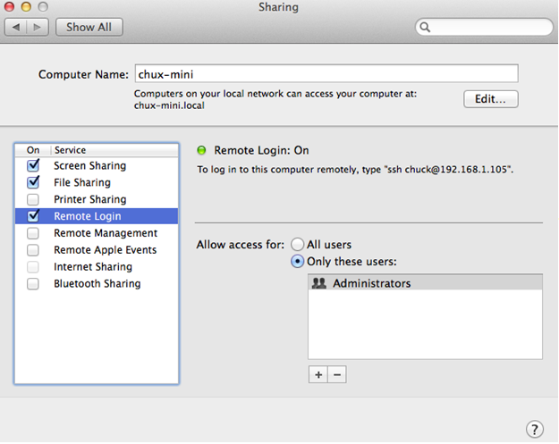

<properties
   pageTitle="Run the Android emulator on OSX when using Windows in Parallels | Cordova"
   description="description"
   services="na"
   documentationCenter=""
   authors="Mikejo5000"
   tags=""/>
<tags
   ms.service="na"
   ms.devlang="javascript"
   ms.topic="article"
   ms.tgt_pltfrm="mobile-multiple"
   ms.workload="na"
   ms.date="09/10/2015"
   ms.author="mikejo"/>

# Run the Android emulator on OSX when using Windows in Parallels

Visual Studio Tools for Apache Cordova allow you to build cross-platform, multi-device hybrid apps based on [Apache Cordova](http://cordova.apache.org/). In other tutorials, we’ve shown how to [Build a Cordova app for iOS using Parallels](./getting-started/build_ios_parallels.md) so you can use the tools from your Mac. In this tutorial, we will show how to speed up Android emulation by running the Android emulator on OSX rather than inside Parallels running Windows using a SSH tunnel. The instructions here use the Android emulator as an example, but you should be able to do this with other emulators like GenyMotion as well.

## Installation and Setup

Most of the steps in this section show how to install and configure Java and the Android SDK on your Mac. If you have already installed and configured Java and the Android SDK on your Mac, all you need to do is enable **Remote Login** in the OSX Sharing settings, and then you can skip to the Windows setup. If not, follow the complete step-by-step instructions in this section.

### Parallels

First, make sure that you have configured your Parallels VM setup to run in Shared Networking mode (it is the default setting).

### OSX

Because you will be setting up an SSH tunnel, you will need to enable SSH logins for your Mac. Start the Settings app then go to **Sharing** and Check **Remote Login**.

Next, install and configure Java and the Android SDK.

#### To install and configure Java and the Android SDK

1. Download and install [JDK 7](http://www.oracle.com/technetwork/java/javase/downloads/java-se-jdk-7-download-432154.html) for Mac. 2. Download the [Android SDK tools](http://developer.android.com/sdk/index.html) for Mac.

   >**Note:**
   You can choose the download under **Get the SDK for an existing IDE** if you don’t intend to use the Android IDE directly.

2. Unzip the Android tools.

   In this tutorial, we will assume you’ve unzipped it to your Documents folder (~/Documents/android-sdk-macosx).

3. Open the Terminal app and type the following command:

        ~/Documents/android-sdk-macosx/tools/tools/android

4. Deselect anything you do not want to install, but make sure the following are selected:

   * Android 4.4.2 (API 19)

   * Extras/Intel x86 Emulator Accelerator (HAXM installer)

5. Choose **Install packages…**

6. After the installation has completed, make sure you close the Android SDK Manager.

7. Install the Intel HAXM driver.

   1. In Finder, go to **Documents**, **android-sdk-macosx**, **extras**, **Intel**, and then **Hardware_Accelerated_Execution_Manager**.

   2. Open IntelHAXM_x.x.x.dmg.

   3. Open the .mpkg file in the folder window that appears.

   4. Follow the installation instructions.

8. In the Terminal app, type:

         ~/Documents/android-sdk-macosx/tools/android avd

9. Create an AVD image, start it, and verify that it runs. Make sure to select the following options:

   * Set CPU/ABI to an **Intel Atom (x86)** system image.

   * Select **Use Host GPU**.

To start up your Android emulator images in the future, use the android avd command.

### Windows

Next, start Parallels and configure Windows.

#### To setup Windows

1. Download plink from the [Putty website](http://www.chiark.greenend.org.uk/~sgtatham/putty/download.html) and place it in a folder. Next, you will create two scripts. The scripts will shut down the “Android Debug Bridge (adb)” if it is running and setup an SSH tunnel from Windows to OSX.

2. For the first script, create a new file in this same folder called “connect-to-mac.cmd” and copy the following script into the file.

          @echo off
          adb.exe kill-server
          plink -L 5554:localhost:5554  -L 5555:localhost:5555 -m mac-script.sh -l
          johndoe123 -pw  johnspassword johnsmac.microsoft.com

3. In the preceding script, replace:

  * “jondoe123” with your Mac user name

  * “johnspassword” with your Mac password

  * “johnsmac.microsoft.com” with either the IP address or the host name of your Mac

4. For the second script, create another file in this same folder called “mac-script.sh” and copy the following script into the file:

          #!/bin/sh
          ~/Documents/android-sdk-macosx/platform-tools/adb kill-server
          read -p "Press any key to terminate SSH tunnel" anykey

5. In the preceding script, replace “~/Documents/android-sdk-macosx” with the location where you unzipped the Android SDK.

Windows is now configured and ready to go.

## Run the Emulator

Follow these instructions each time you startup your Mac and Parallels.

### To run the emulator

1. In OSX, open the Terminal app and type:

           ~/Documents/android-sdk-macosx/tools/android avd

2. Use the AVD Manager to start the Android emulator that you want to use.

3. On Windows in Parallels, take the following steps:

   1. Go to the location where you created connect-to-mac.cmd.
   2. Open connect-to-mac.cmd.
   3. Leave the window open!

After you do this, you should connect any attached Android devices to the Mac side not the Windows side if prompted by Parallels.

That’s it! You can now start Visual Studio and run your app on the Android Emulator in the same way that you normally run it.
