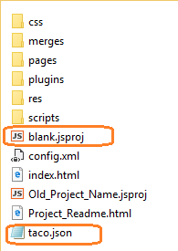

<properties
   pageTitle="Migrate a Visual Studio 2013 project to Visual Studio 2015 | Cordova"
   description="description"
   services="na"
   documentationCenter=""
   authors="Mikejo5000"
   tags=""/>
<tags
   ms.service="na"
   ms.devlang="javascript"
   ms.topic="article"
   ms.tgt_pltfrm="mobile-multiple"
   ms.workload="na"
   ms.date="09/10/2015"
   ms.author="mikejo"/>

# Migrate a Visual Studio 2013 project to Visual Studio 2015

The new project structure in Visual Studio 2015 makes Visual Studio much easier to use with 3rd party tools and CLIs. Migration to Visual Studio 2015 is recommended. Some extra steps are required to migrate a Visual Studio 2013 project to Visual Studio 2015.

## Create a blank project in Visual Studio 2015

2. If you haven't already, [Install Visual Studio 2015] (http://go.microsoft.com/fwlink/?LinkID=533794) with Visual Studio Tools for Apache Cordova.

  

3. Make sure your Visual Studio 2015 setup is correct by creating and running the default Blank App template.
     * In Visual Studio, choose **File**, **New**, **Project**, **JavaScript**, **Apache Cordova Apps**, **Blank App** and name the new project "blank".

     **Note** For TypeScript projects, you can use the TypeScript equivalent of this same project.
     * Choose **Windows**, **Local Machine** and press F5 to run the app (make sure the app loads correctly). If any issues occur, see [Configure the Tools] (configure-vs-tools-apache-cordova.md) or [Read up on additional known issues](../cordova-docs-readme.md).

## Update your existing project
1. Make a backup of your existing project (obligatory first step :))
2. In Windows, open the folder where you created the Blank App project (which you named "blank" in the previous steps).
3. Copy blank.jsproj and taco.json from this folder to your existing project folder.

  

4. Delete the older .jsproj file and, optionally, rename blank.jsproj to re-use the old name.

5. In your older project, create a new folder named **www** in the same location as the `res` folder and `config.xml`.
6. In your existing project, delete the following folders:
	 * bin
	 * bld
7. Leave the following folders and files where they are in your project:
	 * merges
	 * res
	 * plugins
	 * config.xml
8. Copy all other files and folders, including index.html, into the new `www` folder.

  Here is an example of what your updated project structure should look like.

  

9. If you're using TypeScript, you'll need to add a tsconfig.json to your project folder and define config settings for your project. See the [Configuring TypeScript](../getting-started/tutorial-typescript.md) section for details.
10. Open the .jsproj file in Visual Studio 2015.

  Now you can build and run your application by pressing F5 with the desired deployment target selected.

  If you have errors, you may need to update file references to reflect the new folder structure.

## Update Configl.xml

Next, you need to make sure that your icons and splash screens are picked up correctly in the updated project.

1. In Visual Studio's Solution Explorer, open config.xml.
2. From the config.xml shortcut menu, choose **View Code**.
2. In config.xml, replace the platform section, such as the following:
  ```
  <vs:platformSpecificValues>
  <vs:platformSpecificWidget platformName="windows" id="" version="0.0.0.0">
    <vs:name />
  </vs:platformSpecificWidget>
</vs:platformSpecificValues>
  ```
  with this xml:

  ```
  <platform name="android">
    <icon src="res/icons/android/icon-36-ldpi.png" density="ldpi" />
    <icon src="res/icons/android/icon-48-mdpi.png" density="mdpi" />
    <icon src="res/icons/android/icon-72-hdpi.png" density="hdpi" />
    <icon src="res/icons/android/icon-96-xhdpi.png" density="xhdpi" />
  </platform>
  <platform name="ios">
    <icon src="res/icons/ios/icon-60-3x.png" width="180" height="180" />
    <icon src="res/icons/ios/icon-60.png" width="60" height="60" />
    <icon src="res/icons/ios/icon-60-2x.png" width="120" height="120" />
    <icon src="res/icons/ios/icon-76.png" width="76" height="76" />
    <icon src="res/icons/ios/icon-76-2x.png" width="152" height="152" />
    <icon src="res/icons/ios/icon-40.png" width="40" height="40" />
    <icon src="res/icons/ios/icon-40-2x.png" width="80" height="80" />
    <icon src="res/icons/ios/icon-57.png" width="57" height="57" />
    <icon src="res/icons/ios/icon-57-2x.png" width="114" height="114" />
    <icon src="res/icons/ios/icon-72.png" width="72" height="72" />
    <icon src="res/icons/ios/icon-72-2x.png" width="144" height="144" />
    <icon src="res/icons/ios/icon-small.png" width="29" height="29" />
    <icon src="res/icons/ios/icon-small-2x.png" width="58" height="58" />
    <icon src="res/icons/ios/icon-50.png" width="50" height="50" />
    <icon src="res/icons/ios/icon-50-2x.png" width="100" height="100" />
  </platform>
  <platform name="windows">
    <icon src="res/icons/windows/Square150x150Logo.scale-100.png" width="150" height="150" />
    <icon src="res/icons/windows/Square150x150Logo.scale-240.png" width="360" height="360" />
    <icon src="res/icons/windows/Square30x30Logo.scale-100.png" width="30" height="30" />
    <icon src="res/icons/windows/Square310x310Logo.scale-100.png" width="310" height="310" />
    <icon src="res/icons/windows/Square44x44Logo.scale-240.png" width="106" height="106" />
    <icon src="res/icons/windows/Square70x70Logo.scale-100.png" width="70" height="70" />
    <icon src="res/icons/windows/Square71x71Logo.scale-240.png" width="170" height="170" />
    <icon src="res/icons/windows/StoreLogo.scale-100.png" width="50" height="50" />
    <icon src="res/icons/windows/StoreLogo.scale-240.png" width="120" height="120" />
    <icon src="res/icons/windows/Wide310x150Logo.scale-100.png" width="310" height="150" />
    <icon src="res/icons/windows/Wide310x150Logo.scale-240.png" width="744" height="360" />
  </platform>
  <platform name="wp8">
    <icon src="res/icons/wp8/ApplicationIcon.png" width="62" height="62" />
    <icon src="res/icons/wp8/Background.png" width="173" height="173" />
  </platform>
  <platform name="android">
    <splash src="res/screens/android/screen-hdpi-landscape.png" density="land-hdpi"/>
    <splash src="res/screens/android/screen-ldpi-landscape.png" density="land-ldpi"/>
    <splash src="res/screens/android/screen-mdpi-landscape.png" density="land-mdpi"/>
    <splash src="res/screens/android/screen-xhdpi-landscape.png" density="land-xhdpi"/>
    <splash src="res/screens/android/screen-hdpi-portrait.png" density="port-hdpi"/>
    <splash src="res/screens/android/screen-ldpi-portrait.png" density="port-ldpi"/>
    <splash src="res/screens/android/screen-mdpi-portrait.png" density="port-mdpi"/>
    <splash src="res/screens/android/screen-xhdpi-portrait.png" density="port-xhdpi"/>
  </platform>
  <platform name="ios">
    <splash src="res/screens/ios/screen-iphone-portrait.png" width="320" height="480"/>
    <splash src="res/screens/ios/screen-iphone-portrait-2x.png" width="640" height="960"/>
    <splash src="res/screens/ios/screen-ipad-portrait.png" width="768" height="1024"/>
    <splash src="res/screens/ios/screen-ipad-portrait-2x.png" width="1536" height="2048"/>
    <splash src="res/screens/ios/screen-ipad-landscape.png" width="1024" height="768"/>
    <splash src="res/screens/ios/screen-ipad-landscape-2x.png" width="2048" height="1536"/>
    <splash src="res/screens/ios/screen-iphone-568h-2x.png" width="640" height="1136"/>
    <splash src="res/screens/ios/screen-iphone-portrait-667h.png" width="750" height="1334"/>
    <splash src="res/screens/ios/screen-iphone-portrait-736h.png" width="1242" height="2208"/>
    <splash src="res/screens/ios/screen-iphone-landscape-736h.png" width="2208" height="1242"/>
  </platform>
  <platform name="windows">
    <splash src="res/screens/windows/SplashScreen.scale-100.png" width="620" height="300"/>
    <splash src="res/screens/windows/SplashScreen.scale-240.png" width="1152" height="1920"/>
    <splash src="res/screens/windows/SplashScreenPhone.scale-240.png" width="1152" height="1920"/>
  </platform>
  <platform name="wp8">
    <splash src="res/screens/wp8/SplashScreenImage.jpg" width="480" height="800"/>
  </platform>
  ```


----------
## More Information
* [Read up on additional known issues, tips, tricks, and tutorials](../cordova-docs-readme.md)
* [Download samples from our Cordova Samples repository](http://github.com/Microsoft/cordova-samples)
* [Follow us on Twitter](https://twitter.com/VSCordovaTools)
* [Visit our site http://aka.ms/cordova](http://aka.ms/cordova)
* [Ask for help on StackOverflow](http://stackoverflow.com/questions/tagged/visual-studio-cordova)
* [Email us your questions](mailto://multidevicehybridapp@microsoft.com)
