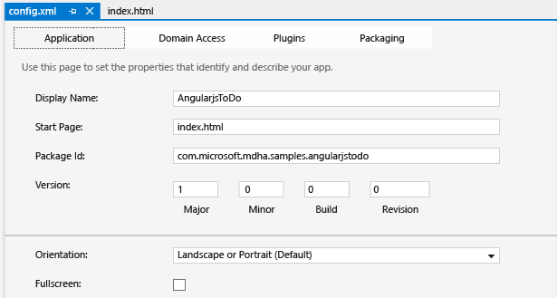
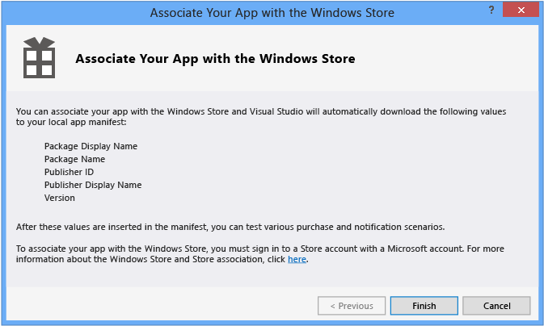

<properties
   pageTitle="Package Your App Built with Visual Studio Tools for Apache Cordova | Cordova"
   description="description"
   services="na"
   documentationCenter=""
   authors="Mikejo5000"
   tags=""/>
<tags
   ms.service="na"
   ms.devlang="javascript"
   ms.topic="article"
   ms.tgt_pltfrm="mobile-multiple"
   ms.workload="na"
   ms.date="09/10/2015"
   ms.author="mikejo"/>
# Package Your App Built with Visual Studio Tools for Apache Cordova

When you package the app you created using Visual Studio Tools for Apache Cordova, you’ll want to configure the settings required for publishing your app. In addition to general settings, there are also platform-specific steps required in most cases.

In this article:

*   [Configure build settings](#Build)

*   [Configure general app package settings](#General)

*   [Package and sign an Android app](#Android)

*   [Package and sign an iOS app](#iOS)

*   [Package and sign a Windows 8, Windows 8.1, or Windows Phone 8.1 app](#Windows)

*   [Package and sign a Windows Phone 8 app](#WindowsPhone)

For a tutorial that walks you through the packaging and publishing process, see [Package and publish your Cordova applications](https://github.com/Microsoft/cordova-docs/blob/master/tutorial-package-publish).

## Configure build settings

When building your app, you need to choose the correct build configuration. You can choose either Debug or Release build configurations.

*   Debug. This build configuration is used to debug apps. For Android, this creates a debug APK (with no release signing). For iOS, by default the Visual Studio remote agent selects the first valid iOS Development signing identity installed on your Mac.

*   Release. This build configuration should be used for release packages. For Android, you need to provide a keystore that is used to sign the release APK. For iOS, by default the Visual Studio remote agent selects the first valid iOS Distribution signing identity installed on your Mac.

## Configure general app package settings

You can specify details such as the package ID and version number by using the configuration designer, which is the Visual Studio interface for the config.xml file. In Solution Explorer, open the shortcut menu for config.xml, and then choose **Open** or **View Designer** (or double-click the file).

You must configure the following settings to package your app for distribution.

*   **Display Name**, which specifies the name of the application that appears in an app store.

    **Note** The Windows Store display name and package ID are specified in a different way. See the  [Package and sign a Windows 8, Windows 8.1, and Windows Phone 8.1 app](#Windows) section later in this article.

*   **Package Id**, which specifies a unique string that identifies your app on each platform (except Windows 8) when you publish your app to a store.

*   **Version**, which specifies your app’s version number.  Some app stores may have independent versioning that is assigned when the app is published. However, for platforms like iOS, you should keep this number in sync with the version you configure in iTunes Connect.

*   **Domain Access**, which specifies the set of domains your app can access content from. During development, we recommend using the default value, "*", which provides access to all content. However, before releasing your app, use this setting to restrict your app to specific domains required by your app. (Windows 8 doesn’t currently use this configuration setting.)

For information about preferences you can manually set in config.xml, see [The config.xml File](http://go.microsoft.com/fwlink/p/?LinkID=510632&clcid=0x409) in the Apache Cordova documentation.

##  Package and sign an Android app

Each time you build your app for Android, a package is created. Extra steps are required to sign your app for distribution.

### To sign an Android app for distribution

1. Generate a keystore and provide the information required to create a certificate (private key). For more information, see [Signing your applications](http://developer.android.com/tools/publishing/app-signing.html) in the Android documentation.

2.  When you have created a keystore, open the res\native\android folder.

3.  Open the ant.properties file, and enter information about the keystore and the alias.

    The `Key.store` property in ant.properties must specify a relative or absolute path to the certificate file.

5.  Put the keystore you created either in the same folder as ant.properties, or in some other location. (For example, for security reasons, you might not want to check the keystore into source control.)

6.  Build the Android app.

    When you build the app, Visual Studio will sign the package with the credentials you supplied.

**Caution** Visual Studio doesn’t validate the credentials, so make sure that they’re correct.

If you accidentally delete the ant.properties file, create a new project and copy the file from your new project to the previous project.

**Tip** For information on how to create the packaging assets for Android, see the [Android section in the walkthrough on packaging](../tutorial-package-publish/tutorial-package-publish-readme.md#android).

## <a id="iOS">Package and sign an iOS app

To generate a package that can be used on an iOS device, you need to sign it by using a valid Apple iOS Developer account and a Mac with Xcode.

### To sign an iOS app

1.  Create a provisioning profile for your app through the Apple Developer portal.

2.  Download and install the provisioning profile on the Mac you’re using as your build machine.

3.  In Xcode, open the **Accounts** preferences pane, and check whether your Apple ID is registered. If it's not listed, choose the **+** button to add it.

4. In Visual Studio, choose a Debug or Release configuration.

    *   When building a Debug configuration, by default the Visual Studio remote agent selects the first valid iOS Development signing identity installed on your Mac.

    *   When building a Release configuration, by default the Visual Studio remote agent selects the first valid iOS Distribution signing identity installed on your Mac.

    **Important** Make sure that your Mac has the appropriate provisioning profile that corresponds to the configuration you choose. For detailed information, read the  in the iOS Developer Library.[Maintaining Your Signing Identities and Certificates](https://developer.apple.com/library/ios/documentation/IDEs/Conceptual/AppDistributionGuide/MaintainingCertificates/MaintainingCertificates.html)

    **Note** A signing identity is valid if the provisioning profile identifier matches the package ID specified in the Visual Studio configuration designer. For example, a provisioning profile of `com.msft.multidevice.*` matches a package ID of com.msft.multidevice.someName. In many cases, you can use a wildcard provisioning profile that matches all package IDs, in which case validity isn’t a concern.

5.  Build your app.

**Tip** For information on how to create the packaging assets for iOS, see the [iOS section in the walkthrough on packaging](../tutorial-package-publish/tutorial-package-publish-readme.md#ios).

### To force a specific signing identity

1.  Create a res\native\ios\cordova folder in your Cordova project.

2.  To override the signing identity or provisioning profile for the Debug configuration, place a custom build-debug.xcconfig file in this folder, or place a build-release.xcconfig file to override the Release configuration.

    *   The base files can be found [here](http://go.microsoft.com/fwlink/?LinkID=532872&clcid=0x409) on github.

    *   build-release.xcconfig has a sample of the syntax for setting a signing identity.

    *   When creating your own xcconfig file, be sure to include the following at the top of the file: `#include "build.xcconfig"`

    *   For a complete set of build settings that can be overridden, see [Xcode build settings](http://go.microsoft.com/fwlink/?LinkID=532831&clcid=0x409).

## Package and sign a Windows 8, Windows 8.1., or Windows Phone 8.1 app

Visual Studio provides built-in features to package Windows 8, Windows 8.1, and Windows Phone 8.1 apps for distribution. These packages are APPX packages.

**Caution** The AppxManifest may not get updated correctly when you do create a Store association. This may result in an error when publishing an app to the Store. Additionally, the Config Designer does not currently provide a method to create APPX bundles. See [Known Issues](http://go.microsoft.com/fwlink/p/?linkid=398782) for workarounds to these common issues.

### To sign a Windows 8, Windows 8.1, or Windows Phone 8.1 app for distribution

1.  In Visual Studio, choose Project, Store, Associate App with the Store.

    
2.  When prompted, sign in with your Microsoft account, choose a name for your app, and then choose **Reserve**.

    **Caution** App names must be unique within the Windows Store.

3.  After the app is reserved, choose **Associate**.

    Visual Studio updates the app package. To see where the reserved name is used, open the configuration designer and look at the display name and package ID in the **Packaging** tab.

**Tip** For information on how to create the packaging assets for Windows, see the [Windows section in the walkthrough on packaging](../tutorial-package-publish/tutorial-package-publish-readme.md#windows).

## Package and sign a Windows Phone 8 app

Windows Phone 8 apps are automatically packaged and don’t have to be signed at build time. You can submit the generated XAP file to the store as described in [Submit your app](https://msdn.microsoft.com/library/windowsphone/help/jj206724.aspx) in the Windows Dev Center.

**Note** If you configure Windows Phone 8.1 as the build target, the generated package is an APPX. For more information, see the preceding section.

If you need to change the default language in a Windows Phone 8 package, locate the WMAppManifest.xml file in bld/Debug/platforms/wp8, modify the `<DefaultLanguage code="en-US" xmlns="" />` tag, and include the file into your Visual Studio project in the following folder: /res/native/wp8/Properties. In this way, you can include the custom XML file in your generated project.

 [Get the Visual Studio Tools for Apache Cordova](http://aka.ms/mchm38) or [learn more](https://www.visualstudio.com/cordova-vs.aspx)

## See Also

[Publish Your App Built with Visual Studio Tools for Apache Cordova](publish-app-built-with-visual-studio.md)
