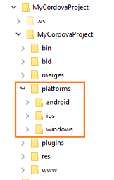
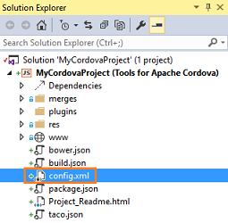

<properties
   pageTitle="Change the CLI version of your Visual Studio Tools for Apache Cordova project | Cordova"
   description="Change the CLI version of your Visual Studio Tools for Apache Cordova project"
   services="na"
   documentationCenter=""
   authors="normesta"
   tags=""/>
<tags
   ms.service="na"
   ms.devlang="javascript"
   ms.topic="article"
   ms.tgt_pltfrm="mobile-multiple"
   ms.workload="na"
   ms.date="12/03/2015"
   ms.author="normesta"/>

# Change the CLI version of your Visual Studio Tools for Apache Cordova project

>NOTE: This article applies to Visual Studio 2015 Tools for Apache Cordova **Update 5**

You can update your project to use new versions of the Cordova Command-Line Interface (CLI).  New versions often include bug fixes and other improvements. However, they can also cause problems for plugins and the version of Node.js that you have installed on your computer or Mac.

This topic helps you decide whether to update the CLI version and how to do it safely.

## Step 1: Find the CLI version number of your project

The CLI version number appears in the **Platforms** page of the configuration designer.


You can also find it in the ```taco.json``` file at the root of your project.

When you create a project, Visual Studio uses a specific version of the Cordova CLI, but this version  becomes outdated over time. If you want to use a more recent version of the CLI, you have to make this change manually.

## Step 2: Consider how this change will impact plugins

Plugins are tested against a specific version of each Cordova platform. For example, to ensure that a plugin works on a mobile device that runs on the most recent version of the Android 6.0 "Marshmallow" operating system, the author validates the plugin against the *cordova-android 5.0.0* platform. In a sense, it's tied to that version of the Android platform.

The Apache Cordova CLI does something very similar. It's also tied or *pinned* to a specific version of each Cordova platform. When you first create a project, your CLI and the plugins that you add to your project are tied to the same platform versions.

If you update your CLI, it's tied to a newer version of each Cordova platform while your plugins remain tied to a previous version of each Cordova platform.

This isn't always a problem, but if a new version introduces a breaking change, you might encounter errors when you build your project or attempt to run code that uses the plugin.

You might encounter the opposite problem if you don't update the CLI version of your project. Plugins that already exist in your project work fine, but any new plugin that you add to your project might not. That's because when you add a plugin, Visual Studio uses the most recent version of it and that plugin could be tied to newer version of each Cordova platform.

Have a quick look at this table. It presents each action, its impact, and what you can do to increase the likelihood that your plugins will work properly.

> **Note**: This table uses the term *existing* to refer to plugins that exist in your project when you decide to update your project's CLI version and the term *new* to refer to plugins that you add to your project after you update your project's CLI version.

<style>
    table, th, td {
        border: 1px solid black;
        border-collapse: collapse;
    }
    th, td {
        padding: 5px;
    }
</style>
<table>
    <thead>
        <tr>
            <th>Action</th>
            <th style="text-align:left">Impact on plugins</th>
            <th style="text-align:left">What you can do</th>
        </tr>
    </thead>
    <tbody>
        <tr>
            <td>Use the most recent version of the CLI</td>
            <td style="text-align:left">Existing plugins might not work as expected if they're tied to an older version of each Cordova platform.</td>
            <td style="text-align:left">Remove those plugins from your project.  Then, add the most recent version of those plugins to your project.</td>
        </tr>
        <tr>
            <td>Continue using the same version of the CLI</td>
            <td style="text-align:left">New plugins might not work as expected unless you explicitly add an older version of the plugin. </td>
            <td style="text-align:left">If no breaking changes were introduced in newer versions of each Cordova platform then plugins might work as expected.<br><br>If things don't quite work right in code that use those plugins, just add older versions of plugins to your project. </td>
        </tr>
        <tr>
            <td>Use an older version of the CLI</td>
            <td style="text-align:left">All plugins (new or existing) might not work as expected.<br><br></td>
            <td style="text-align:left">Remove existing plugins from your project and then add an older version of each plugin to your project.
            <br><br>If you want to add a new plugin, add older version of those plugins as well. </td>
        </tr>
    </tbody>
</table>

>**Note**: If you install a newer (or older) version of a plugin, and you receive build errors, the API of the plugin might have changed. If that happens, you might have to change your code to use the API of that plugin version.

## <a id="node-compat"></a>Step 3: Consider how this change will impact Node.js

Cordova uses [Node.js](http://nodejs.org/) to perform automation tasks. You installed it when you first setup the tools for Apache Cordova.

Before you change your project's CLI version. Plan to use a compatible version of Node.js. This table shows what versions you'll need. You'll still encounter the occasional bug, but by using these combinations, you'll receive the fewest numbers of them.

<table>
    <thead>
        <tr>
            <th>CLI version</th>
            <th style="text-align:left">Node.js version</th>
        </tr>
    </thead>
    <tbody>
        <tr>
            <td><strong>5.4.1</strong> and later</td>
            <td style="text-align:left"><strong>5.x</strong>, <strong>4.x</strong>, or <strong>0.12.x</strong></td>
        </tr>
        <tr>
            <td><strong>5.3.3</strong> and later</td>
            <td style="text-align:left"><strong>4.x</strong>, or <strong>0.12.x</strong></td>
        </tr>
        <tr>
            <td>Earlier than <strong>5.3.3</strong></td>
            <td style="text-align:left"><strong>0.12.x</strong></td>
        </tr>
    </tbody>
</table>

## Step 4: Proceed with changing the CLI version of your project

1. First, back up any file that you directly modified in the **platforms** folder of your project.    Visual studio will remove the **platform** folder and any file inside of it when you build your project.

    Most likely, you haven't made direct edits to this folder. Editing these files is an advanced task and you'd have to make those edits outside of Visual Studio.

    The following image shows this folder.

    

    If you didn't directly edit these files outside of Visual Studio, you can move to the next step.

2. In **Solution Explorer**, double-click the **config.xml** file to open the configuration designer.

    

3. In the configuration designer, choose the **Platforms** tab, and then, in the **Cordova CLI** drop-down list, choose the version of the Cordova CLI that you want to use.

    

4. In Visual Studio, choose **Build**->**Rebuild Solution**.

    This removes and then replaces all subfolders from the **Platform** folder of your project.

5. Add back any manual tweaks to files in platform subfolders.

6. Update your plugins by removing them and then adding them back to your project.

    * If you chose to use the most recent version of the CLI, see [Update a plugin to use the most recent version](./develop-apps/manage-plugins.md#Updating).

    * If you chose to use an older version of the CLI version, see [Update a plugin to use an older version](./develop-apps/manage-plugins.md#Older).

7. Open a Terminal (on a Mac) or open a Command Prompt (on a Windows computer).

8. Run this command: ```node -v```

    The Node.js version appears.

    Make sure that you have a compatible version of node.js installed on your computer or Mac by reviewing the table above in [Step 3: Consider how this change will impact Node.js](#node-compat).

## Learn more about changes in Apache Cordova 5.x and 6.x

Cordova 5 and Cordova 6 introduce changes such as a new security model, a new way to obtain plugins, and a new build system. You can read more about these changes and how they affect your project here: [Adapting to changes caused by Apache Cordova 5.x and 6.x](https://github.com/Microsoft/cordova-docs/blob/master/articles/tutorial-cordova-5/tutorial-cordova-5-readme.md).
