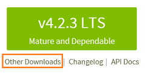

<properties
   pageTitle="Safely update Node.js (Visual Studio Tools for Apache Cordova) | Cordova"
   description="Safely update Node.js (Visual Studio Tools for Apache Cordova)"
   services="na"
   documentationCenter=""
   authors="normesta"
   tags=""/>
<tags
   ms.service="na"
   ms.devlang="javascript"
   ms.topic="article"
   ms.tgt_pltfrm="mobile-multiple"
   ms.workload="na"
   ms.date="12/15/2015"
   ms.author="normesta"/>

# Safely update Node.js (Visual Studio Tools for Apache Cordova)

Cordova uses [Node.js](http://nodejs.org/) to perform automation tasks.  

New versions of Node.js include bug fixes and other improvements. Before you install one, make sure that it's compatible with the version of Cordova Command Line Interface (CLI) that your project uses. This topic helps you do that.

## Find out which version of Node.js is installed

If you're unsure what version of Node.js you have installed, do these things.

1. Open a Terminal (on a Mac) or open a Command Prompt (on a Windows computer).

2. Run this command: ```node.js -v```

   The Node.js version appears.

## Install a newer version of Node.js

To use Node.js version ```4.x```, make sure that your project uses Cordova CLI version ```5.3.3```.

To use Node.js version ```5.x```, make sure that your project uses Cordova CLI version ```5.4.1```.

See [Change your project's CLI version](change-cli-version.md).

No other combination of Node.js and the Cordova CLI has been tested.

Unless you have a specific reason to use a newer versions of Node.js, use version ```0.12.x```  because it's compatible with all versions of the Cordova CLI.

## Install the most compatible version of Node.js (0.12.x)

If you've already installed a newer version of Node.js, and you don't want to use version ```5.3.3``` or ```5.4.1``` of the Cordova CLI, just install version ```0.12.x``` of Node.js. Then, you can use whatever version of the Cordova CLI that you want.

1. In your browser, open the [Node.js](http://nodejs.org/) page and choose the **Other Downloads** link.

    

2. Choose the ```../``` link.

    

3. In the index of folders, open the folder for the most recent minor version of the the **v0.12.x**.

    The following image shows that the most recent minor version is **v0.12.9**

    

4. Choose the right installer file.

    * If you are installing this onto a Windows computer, run the file that has the ```.msi``` extension.

    * If you're installing this onto a Mac, run the file that has the ```.pkg``` extension.
