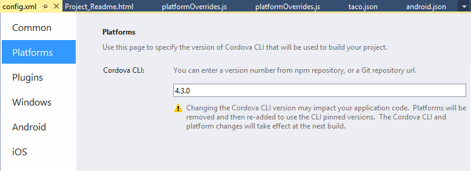
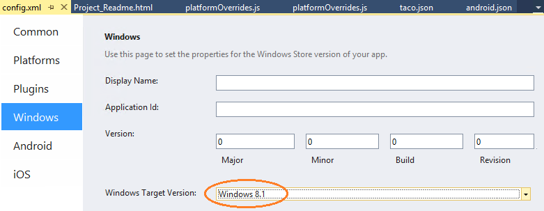

<properties
   pageTitle="Configure your app built with Visual Studio Tools for Apache Cordova | Cordova"
   description="description"
   services="na"
   documentationCenter=""
   authors="normesta"
   tags=""/>
<tags
   ms.service="na"
   ms.devlang="javascript"
   ms.topic="article"
   ms.tgt_pltfrm="mobile-multiple"
   ms.workload="na"
   ms.date="09/10/2015"
   ms.author="normesta"/>
# Configure your app built with Visual Studio Tools for Apache Cordova

A config.xml file included in each project provides most of your app configuration such as the app’s display name and start page. From **Solution Explorer**, you can double-click this file to open it in the configuration designer, a Visual Studio interface for the file.

Alternatively, you can select **View Code** from the context menu to edit the file directly. For more information about this file, see [config.xml file](http://go.microsoft.com/fwlink/p/?LinkID=510632) in the Apache Cordova documentation.

>**Caution:**
If you edit the config.xml file directly, make sure that your XML elements and attributes are valid. Invalid content in the XML file will result in errors when you build the app.

## Configure the Cordova CLI version

You can use the configuration designer to change the CLI version used in your project. To change the version, choose the **Platforms** tab and enter one of the following:

* Cordova CLI version (for example, 4.3.0).

* Git repository (for example, https://github.com/apache/cordova-cli.git) Alternatively, you can change the Cordova CLI version by editing the taco.json file in your project root.

  >**Caution:**
Changing the Cordova CLI version may impact your application code. Platforms will be removed and then re-added to use the CLI pinned versions.

## Configure the Windows target version

You can change the targeted version of Windows in the configuration designer, under the Windows tab (Windows Target Version).

The options that appear in Windows Target Version depend on which SDK is installed. If you install the Windows 8.0 or Windows 10 SDKs, the corresponding version will appear as an option that you can select. When you change the Windows target version, the following line is modified in your config.xml file:

    <preference name="windows-target-version" value="8.1" />

## Platform-specific visual assets

You can use the res folder in your project to specify visual assets such as icons and splash screens based on device resolution and platform. If you don’t see this folder in your project, you can recreate it manually in **Solution Explorer**.

* res\icons\platform contains the app icons for each platform.

* res\screens\platform contains splash screens for each platform.

    >**Caution:**
Visual Studio 2015 now uses the and config.xml elements to set the location of these files. If you are using a config.xml file from an earlier version, you will need to add these elements to your config.xml file. To do this, simply create a new project from the Blank template, choose View Code from the shortcut menu for the config.xml file in each project, and then copy the required elements from the Blank project to your project.

The file name of each resource provides some information about the asset. For example, the screen-ldpi-portrait.png file in the res\icons\screens\android folder represents a splash screen for a low-resolution screen (ldpi, or 426x320) for an Android device in portrait orientation.

The following table provides the complete list of splash screens and icons that are required if you need to support specific devices and screen resolutions. For additional information about these assets, see Icons and Splash Screens in the Apache Cordova documentation.

<table>

<tbody>
    <tr>
        <th>Icons and splash screens for Android</th>
        <th>Resolution</th>
    </tr>
    <tr>
        <td>res/icons/android/icon-36-ldpi.png</td>
        <td>36x36</td>
    </tr>
    <tr>
        <td>res/icons/android/icon-48-mdpi.png</td>
        <td>48x48</td>
    </tr>
    <tr>
        <td>res/icons/android/icon-72-hdpi.png</td>
        <td>72x72</td>
    </tr>
    <tr>
        <td>res/icons/android/icon-96-xhdpi.png</td>
        <td>96x96</td>
    </tr>
    <tr>
        <td>res/screens/android/screen-xhdpi-landscape.png</td>
        <td>720x960</td>
    </tr>
    <tr>
        <td>res/screens/android/screen-xhdpi-portrait.png</td>
        <td>960x720</td>
    </tr>
    <tr>
        <td>res/screens/android/screen-hdpi-landscape.png</td>
        <td>480x640</td>
    </tr>
    <tr>
        <td>res/screens/android/screen-hdpi-portrait.png</td>
        <td>640x480</td>
    </tr>
    <tr>
        <td>res/screens/android/screen-mdpi-landscape.png</td>
        <td>320x470</td>
    </tr>
    <tr>
        <td>res/screens/android/screen-mdpi-portrait.png</td>
        <td>470x320</td>
    </tr>
    <tr>
        <td>res/screens/android/screen-ldpi-landscape.png</td>
        <td>320x426</td>
    </tr>
    <tr>
        <td>res/screens/android/screen-ldpi-portrait.png</td>
        <td>426x320</td>
    </tr>

</tbody>
</table>
<table>
    <thead>
        <tr>
            <th>Icons and splash screens for iOS</th>
            <th style="text-align:right">Resolution</th>
        </tr>
    </thead>
    <tbody>
        <tr>
            <td>res/icons/ios/icon-57-2x.png</td>
            <td style="text-align:right">114x114 (Retina display)</td>
        </tr>
        <tr>
            <td>res/icons/ios/icon-57.png</td>
            <td style="text-align:right">57x57</td>
        </tr>
        <tr>
            <td>res/icons/ios/icon-72-2x.png</td>
            <td style="text-align:right">144x144 (Retina display)</td>
        </tr>
        <tr>
            <td>res/icons/ios/icon-72.png</td>
            <td style="text-align:right">72x72</td>
        </tr>
        <tr>
            <td>res/icons/ios/icon-40.png</td>
            <td style="text-align:right">40x40</td>
        </tr>
        <tr>
            <td>res/icons/ios/icon-40-2x.png</td>
            <td style="text-align:right">80x80 (Retina display)</td>
        </tr>
        <tr>
            <td>res/icons/ios/icon-50.png</td>
            <td style="text-align:right">50x50</td>
        </tr>
        <tr>
            <td>res/icons/ios/icon-50-2x.png</td>
            <td style="text-align:right">100x100 (Retina display)</td>
        </tr>
        <tr>
            <td>res/icons/ios/icon-60@3x.png</td>
            <td style="text-align:right">180x180 (Retina display)</td>
        </tr>
        <tr>
            <td>res/icons/ios/icon-76.png</td>
            <td style="text-align:right">76x76</td>
        </tr>
        <tr>
            <td>res/icons/ios/icon-76-2x.png</td>
            <td style="text-align:right">152x152 (Retina display)</td>
        </tr>
        <tr>
            <td>res/icons/ios/icon-small.png</td>
            <td style="text-align:right">29x29</td>
        </tr>
        <tr>
            <td>res/icons/ios/icon-small-2x.png</td>
            <td style="text-align:right">58x58 (Retina display)</td>
        </tr>
        <tr>
            <td>res/screens/ios/screen-ipad-landscape.png</td>
            <td style="text-align:right">1024x768</td>
        </tr>
        <tr>
            <td>res/screens/ios/screen-ipad-landscape-2x.png</td>
            <td style="text-align:right">2048x1536</td>
        </tr>
        <tr>
            <td>res/screens/ios/screen-ipad-portrait.png</td>
            <td style="text-align:right">768x1024</td>
        </tr>
        <tr>
            <td>res/screens/ios/screen-ipad-portrait-2x.png</td>
            <td style="text-align:right">1536x2048</td>
        </tr>
        <tr>
            <td>res/screens/ios/screen-iphone-landscape-736h.png</td>
            <td style="text-align:right">2208x1242</td>
        </tr>
        <tr>
            <td>res/screens/ios/screen-iphone-portrait-2x.png</td>
            <td style="text-align:right">640x960</td>
        </tr>
        <tr>
            <td>res/screens/ios/screen-iphone-portrait.png</td>
            <td style="text-align:right">320x480</td>
        </tr>
        <tr>
            <td>res/screens/ios/screen-iphone-portrait-667h.png</td>
            <td style="text-align:right">750x1334</td>
        </tr>
        <tr>
            <td>res/screens/ios/screen-iphone-portrait-736h.png</td>
            <td style="text-align:right">1242x2208</td>
        </tr>
        <tr>
            <td>res/screens/ios/screen-iphone-568h-2x.png</td>
            <td style="text-align:right">640x1136</td>
        </tr>
    </tbody>
</table>
<table>
    <thead>
        <tr>
            <th>Icons and splash screens for Windows Phone 8  Resolution</th>
            <th style="text-align:right">Resolution</th>
        </tr>
    </thead>
    <tbody>
        <tr>
            <td>res/icons/wp8/ApplicationIcon.png</td>
            <td style="text-align:right">62x62</td>
        </tr>
        <tr>
            <td>res/icons/wp8/Background.png</td>
            <td style="text-align:right">173x173</td>
        </tr>
        <tr>
            <td>res/screens/wp8/SplashScreenImage.png</td>
            <td style="text-align:right">480x800</td>
        </tr>
        <tr>
            <td>Icons and splash screens for Windows Phone 8.1</td>
            <td style="text-align:right">Resolution</td>
        </tr>
        <tr>
            <td>res/icons/windows/Square150x150Logo.scale-240.png</td>
            <td style="text-align:right">360x360</td>
        </tr>
        <tr>
            <td>res/icons/windows/Square44x44Logo.scale-240.png</td>
            <td style="text-align:right">106x106</td>
        </tr>
        <tr>
            <td>res/icons/windows/Square71x71Logo.scale-240.png</td>
            <td style="text-align:right">170x170</td>
        </tr>
        <tr>
            <td>res/icons/windows/StoreLogo.scale-240.png</td>
            <td style="text-align:right">120x120</td>
        </tr>
        <tr>
            <td>res/icons/windows/Wide310x150Logo.scale-240.png</td>
            <td style="text-align:right">744x360</td>
        </tr>
        <tr>
            <td>res/screens/windows/SplashScreen.scale-240.png</td>
            <td style="text-align:right">1152x1920</td>
        </tr>
    </tbody>
</table>
<table>
    <thead>
        <tr>
            <th>Icons and splash screens for Windows</th>
            <th style="text-align:right">Resolution</th>
        </tr>
    </thead>
    <tbody>
        <tr>
            <td>res/icons/windows/logo.png</td>
            <td style="text-align:right">150x150</td>
        </tr>
        <tr>
            <td>res/icons/windows/smalllogo.png</td>
            <td style="text-align:right">30x30</td>
        </tr>
        <tr>
            <td>res/icons/windows/storelogo.png</td>
            <td style="text-align:right">50x50</td>
        </tr>
        <tr>
            <td>res/screens/windows/splashscreen.png</td>
            <td style="text-align:right">620x300</td>
        </tr>
    </tbody>
 </table>

Android supports a scalable type of image called a NinePatch that can be used as your splashscreen.

To use a NinePatch splashscreen image on Android

1. Change the following line in config.xml:

       <preference name="SplashScreen" value="screen" />
to

       <preference name="SplashScreen" value="splash" />

2. Place the NinePatch image in the following location: res\native\android\res\drawable-nodpi\splash.9.png
When you build, the image will be copied to the required output folder.

## Platform-specific content

You can include platform-specific HTML, CSS, and JavaScript files in the merges folder in your project. The files you add to this folder either add content to a platform-specific build of your app, or override non-platform-specific content that uses the same file name. For more information about using the merges folder, see the section “Using merges to customize each platform” in the [Apache Cordova documentation](http://cordova.apache.org/docs/en/edge/guide_cli_index.md.html).

If you don’t see the merges folder for your project in **Solution Explorer**, open the shortcut menu for the project in **Solution Explorer**, choose *Add*, and then choose *Add Platform Specific Code* to add the folder.

## Platform-specific configuration files

You can use the res/native folder in your project to inject content into the native project generated by Cordova when you build your app. This can be useful when you need to configure your app to support something Cordova itself does not expose. (Plugins that you add to your project will also automatically modify the custom version of these configuration files.)

>**Caution:**
We recommend avoiding adding platform-specific configuration files when possible.

The following table provides specific information for each platform.

<table>
    <thead>
        <tr>
            <th>Platform</th>
            <th style="text-align:left">Notes</th>
        </tr>
    </thead>
    <tbody>
        <tr>
            <td>Android</td>
            <td style="text-align:left">Place the custom <a href="http://developer.android.com/guide/topics/manifest/manifest-intro.html">AndroidManifest.xml</a> file in the res/native/android folder to configure settings such as custom intents. Use the generated version of the file in the platforms/android folder after building a Debug configuration of the project for Android.</td>
        </tr>
        <tr>
            <td>iOS</td>
            <td style="text-align:left">Place a custom <a href="http://go.microsoft.com/fwlink/?LinkID=532829">build-debug.xcconfig</a> or <a href="http://go.microsoft.com/fwlink/?LinkID=532830">build-release.xcconfig</a> file in res/native/ios/cordova to override signing identities and other <a href="http://go.microsoft.com/fwlink/?LinkID=532831">build settings</a> for these configurations. Place a custom <a href="http://go.microsoft.com/fwlink/?LinkID=532832">Info.plist</a> file in the res/native/ios/config.xml display name folder to override settings like splashscreens or icons. The Info.plist filename must be renamed as follows: config.xml display name-Info.plist to update <a href="http://go.microsoft.com/fwlink/?LinkID=532834">iOS framework keys</a>. You can find a sample version of these and other files in the <a href="http://go.microsoft.com/fwlink/?LinkID=532835">cordova-ios</a> GitHub repository, or when using the remote agent under the ~/remote-builds/build number/cordovaApp folder on your Mac.</td>
        </tr>
        <tr>
            <td>Windows</td>
            <td style="text-align:left">Place the custom package.windows80.appxmanifest (Windows 8.0), package.windows.appxmanifest (Windows 8.1), or package.phone.appxmanifestfile (Windows Phone 8.1) in the res/native/windows folder to override various configuration settings. Use the generated version of the file in the platforms/windows folder after building a Debug configuration of the project for Windows or Windows Phone (Universal).</td>
        </tr>
        <tr>
            <td>Windows Phone 8</td>
            <td style="text-align:left">Place the custom WMAppManifest.xml file in the res/native/wp8/Properties folder. Use the generated version of the file in the platforms/wp8/Properties folder after building a Debug configuration of the project for Windows Phone 8.</td>
        </tr>
    </tbody>
</table>

 [Get the Visual Studio Tools for Apache Cordova](http://aka.ms/mchm38) or [learn more](https://www.visualstudio.com/cordova-vs.aspx)

## See Also

**Concepts**

[Manage Plugins for Apps Built with Visual Studio Tools for Apache Cordova](https://msdn.microsoft.com/en-us/library/dn757051.aspx)  
[Package Your App Built with Visual Studio Tools for Apache Cordova](https://msdn.microsoft.com/en-us/library/dn757048.aspx)  
[Get Started with Visual Studio Tools for Apache Cordova](https://msdn.microsoft.com/en-us/library/dn771545.aspx)

**Other Resources**

[FAQ](http://go.microsoft.com/fwlink/p/?linkid=398476)
