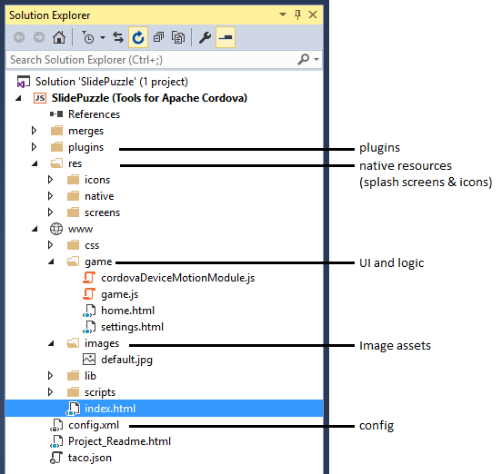
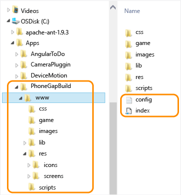
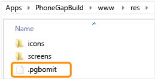
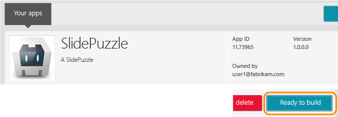
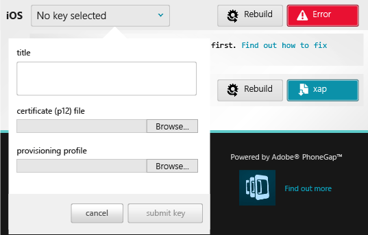
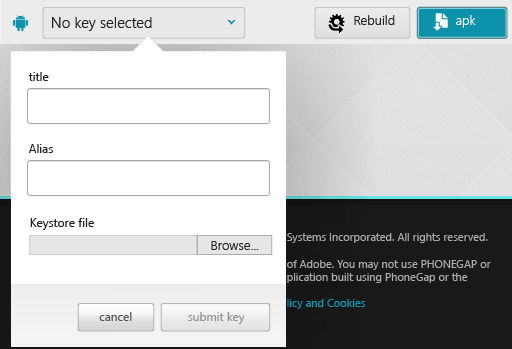

<properties
   pageTitle="Convert a Cordova project to a PhoneGap project | Cordova"
   description="description"
   services="na"
   documentationCenter=""
   authors="subhagpo"
   tags=""/>
<tags
   ms.service="na"
   ms.devlang="javascript"
   ms.topic="article"
   ms.tgt_pltfrm="mobile-multiple"
   ms.workload="na"
   ms.date="09/11/2015"
   ms.author="Subhag.Oak"/>
   
# Convert a Cordova project to a PhoneGap project

PhoneGap is an open source framework for quickly building cross-platform mobile apps using HTML5, JavaScript and CSS. Adobe [PhoneGap Build](https://build.phonegap.com/) is a cloud service that allows you to quickly build mobile applications and easily compile them without SDKs, compilers and hardware. This article describes how to convert an Apache Cordova project created using Visual Studio to a PhoneGap project and use the PhoneGap Build cloud service.

One of the main differences between a Visual Studio Project and the PhoneGap project is the application definition in the configuration file (config.xml). Following this walkthrough will help you change your Visual Studio project into a PhoneGap project.

## Create a new Cordova project using Visual Studio
To create application packages, the cloud-based PhoneGap Build only requires the web-assets of your application, which are limited to your HTML, CSS, images, .js files, and similar files. PhoneGap Build will probably fail to compile your application if native files are uploaded (.h, .m, .java, etc.). Because the project structure created by Visual Studio matches the Cordova project structure, the www folder of your project now hosts all the web assets required by your application.

  

Once you have created a Visual Studio project, you can move your web assets into a PhoneGap Build project. We recommend that you create a new folder (outside your Visual Studio project location) to host your PhoneGap project, and then copy the www folder to this new location.

## Create the PhoneGap Project Structure
When structuring the PhoneGap project, make sure that config.xml and index.html are in the top level of your app folder structure (here, we use the www folder as the top level folder). Otherwise, you can structure your application as needed. Copy the config.xml from the project’s root folder to the www folder of the PhoneGap Build project. Also, copy your native resources from the ‘res’ folder (res\icons and res\screens respectively) to the www folder of the PhoneGap Build project.

Once you copy over all the files and folders, the PhoneGap Build project should look like this:

  

Because your application may contain files or folders not required in your final packaged application (such as unused splash screens, bower packages, grunt artifacts, un-compiled less files, etc.), PhoneGap Build supports a special file called **.pgbomit**.

**.pgbomit** is a file that you can create and add to a folder to instruct PhoneGap Build to exclude the folder as a source of native application files. (However, you can use this folder to store any files needed during the PhoneGap build process up to the compile step.) As a typical example, you may want to place **.pgbomit** in the folder containing the icons and splash-screens. So place **.pgbomit** in the www/res folder of your PhoneGap Build project; as a result, none of files and folders in www/res will be included in the binary app package, except those copied and used for icons and splash-screens for a specific platform.

The following illustration shows the **.pgbomit** file in the www/res folder:

  

Since PhoneGap Build doesn’t support the merges folder of the Cordova CLI project by default, you will need to copy platform-specific contents from the merges folder of your Cordova CLI project into the www folder of the PhoneGap Build project.

##Update Config.xml
PhoneGap Build supports a configuration XML file, config.xml, which is very different from the one generated by Visual Studio project. This configuration file allows you to modify things such as the application's title, icons, splash screens, and other properties.

Start by removing the VS namespace and adding the PhoneGap namespace to the config.xml. The result is shown here:

    <widget xmlns:cdv="http://cordova.apache.org/ns/1.0"
     id="io.cordova.appb64ec64666e9432a9caf5f01009feb88"
      version="1.0.0.0"
      xmlns:gap="http://phonegap.com/ns/1.0"
      xmlns="http://www.w3.org/ns/widgets">
    <name>SlidePuzzle</name>

###Icons
The default icon must be named icon.png and must reside in the root of your application folder. Unless you specify otherwise in config.xml, each platform will try to use the default icon.png during compilation:

    <icon src="icon.png" />

If you want specific icons for the Android platform, the following entries show an example of how to update config.xml based on the contents of your res\icons\android folder in the PhoneGap Build project you previously created.

    <icon src="res/icons/android/icon-36-ldpi.png" density="ldpi" />
    <icon src="res/icons/android/icon-48-mdpi.png" density="mdpi" />
    <icon src="res/icons/android/icon-72-hdpi.png" density="hdpi" />
    <icon src="res/icons/android/icon-96-xhdpi.png" density="xhdpi" />

For more information on specifying icon elements in config.xml, read this [article](http://docs.build.phonegap.com/en_US/configuring_icons_and_splash.md.html#Icons%20and%20Splash%20Screens).

## Splash screens
You can have zero or more splash screen elements present in config.xml. The splash screen element can have src, gap:platform, width and height attributes, just like the <icon> element. Like icon files, save the splash screen files as PNG images. Unless you specify otherwise in config.xml, each platform will use the default splash.png file during compilation. If you do not supply the gap:platform attribute, the default image will be copied to all platforms, increasing the size of each application package.

The default splash screen must be named splash.png and must reside in the root of your application folder:

    <splash src="splash.png" />

If you want specific splash-screens for the Android platform, the following entries show an example of how to update config.xml based on the contents of your res\screens\android folder in the PhoneGap Build project.

    <splash src="res/screens/android/screen-hdpi-landscape.png" density="land-hdpi" />
    <splash src="res/screens/android/screen-ldpi-landscape.png" density="land-ldpi" />
    <splash src="res/screens/android/screen-mdpi-landscape.png" density="land-mdpi" />
    <splash src="res/screens/android/screen-xhdpi-landscape.png" density="land-xhdpi" />
    <splash src="res/screens/android/screen-hdpi-portrait.png" density="port-hdpi" />
    <splash src="res/screens/android/screen-ldpi-portrait.png" density="port-ldpi" />
    <splash src="res/screens/android/screen-mdpi-portrait.png" density="port-mdpi" />
    <splash src="res/screens/android/screen-xhdpi-portrait.png" density="port-xhdpi" />

For more information on specifying splash screen elements in config.xml, see this [article](http://docs.build.phonegap.com/en_US/configuring_icons_and_splash.md.html#Icons%20and%20Splash%20Screens).

### Plugins
To extend access to native platform features exposed by the PhoneGap native-app container, PhoneGap Build supports a white-listed selection of PhoneGap Plugins. For the list of supported plugins, see [Plugins](https://build.phonegap.com/plugins). If you include any plugins that aren't in Adobe's white-list, the build will fail. To import a plugin into your PhoneGap Build project, you will need to add the correct **gap:plugin** element to config.xml. If you omit the version attribute for plugin, the app will always build using the latest version of the plugin.

Here is the most simplistic way of using a versioned plugin:

    <plugin name="com.phonegap.plugins.example" spec="2.2.1" />

Since Visual Studio puts a "version" field which is depracated for PhoneGap build, we need to edit the config.xml entries as below. In the example project we're using, we use two plugins and two corresponding lines in config.xml:

    <plugin name="org.apache.cordova.device-motion" version="0.2.10" />
    <plugin name="org.apache.cordova.camera" version="0.3.2" />

In the PhoneGap Build project, these lines must be changed to:

    <gap:plugin name="org.apache.cordova.device-motion" spec="0.2.10" />
    <gap:plugin name="org.apache.cordova.camera" spec="0.3.2" />

For more information on modifying plugins, see this [article](http://docs.build.phonegap.com/en_US/configuring_plugins.md.html#Plugins).

## Upload your project to PhoneGap
Once you have completed all the required modifications, you can upload your application to the PhoneGap build service. First, create an account for the PhoneGap build service. Then, log onto your account at https://build.phonegap.com/apps to submit your app. You can submit your application either from a GIT repo or you can upload a local ZIP file. In this example, we are going to upload a local ZIP file which contains the zipped www folder. After you upload the ZIP, you will see that your app is ready to build.

  

When you click the Ready to Build button, the PhoneGap build service will start building for the platforms that you've defined in config.xml. Since we haven’t defined any particular platform, the service will build for all the three platforms (iOS, Android, and Windows). After the build completes, you will see the results of the build.

  

## Code sign and provision your app
Because we are using a cloud build service, we will have to set up the code signing and provisioning certificates to support building signed release/distribution packages. For iOS, you can provide the code signing certificate and the mobile provisioning profile here:

  

To build a release APK package for Android that is ready for store submission, PhoneGap build service allows you to provide key-store information and the corresponding passwords here:

  

For Android, we will use an existing key-store that we have created earlier (or you can create a new one using this [guide](http://developer.android.com/tools/publishing/app-signing.html)) and then rebuild the application. Now, the build service creates a fully signed release package that can either be downloaded for publishing to the store or installed on a tethered device.

  

We hope this article helps you to convert your Visual Studio Cordova project into a PhoneGap Build project and to quickly build your apps for iOS, Android, or Windows using the PhoneGap build service.
