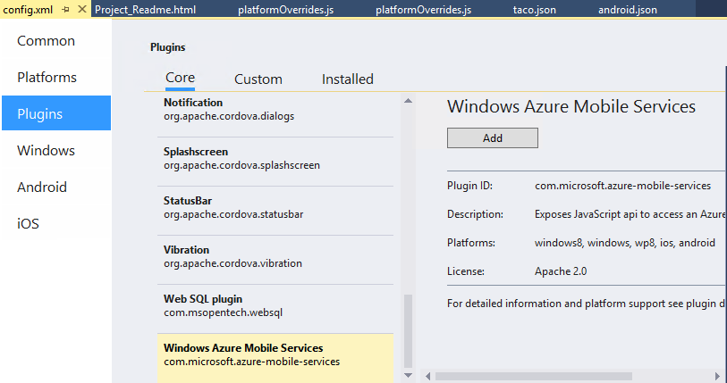
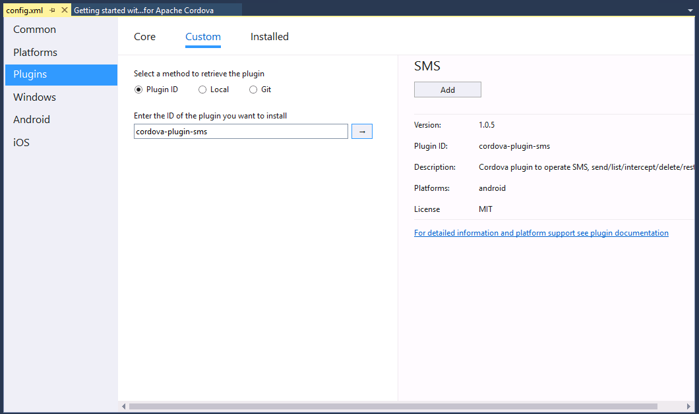
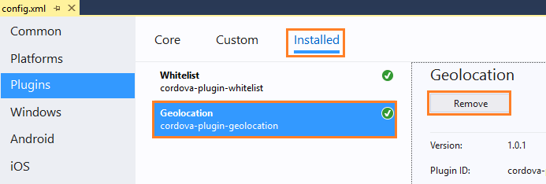

<properties
   pageTitle="Manage plugins for apps built with Visual Studio Tools for Apache Cordova | Cordova"
   description="description"
   services="na"
   documentationCenter=""
   authors="normesta"
   tags=""/>
<tags
   ms.service="na"
   ms.devlang="javascript"
   ms.topic="article"
   ms.tgt_pltfrm="mobile-multiple"
   ms.workload="na"
   ms.date="09/10/2015"
   ms.author="normesta"/>
# Manage plugins for apps built with Visual Studio Tools for Apache Cordova

Apache Cordova uses plugins to provide access to native device capabilities that aren’t available to simple web apps, such as access to the file system. A plugin is a cross-platform Cordova library that accesses native code and device capabilities through a JavaScript interface. When required, the plugin also updates the platform manifest to enable device capabilities. Not all plugins are supported or needed on all device platforms.

You enable plugins by using the Cordova config.xml file. Visual Studio provides ways to update this file using the configuration designer.

>**Note:**
To see the core plugins available in the configuration designer, see [List of available plugins](#List). For more information on plugins, see the [Cordova config.xml documentation](http://go.microsoft.com/fwlink/p/?LinkID=510632).

## <a id="Adding"></a>Add a core plugin

You can add a core Cordova plugin by using Visual Studio. When you build your solution, the plugin is installed from the Cordova registry.

1. In **Solution Explorer**, open the shortcut menu for the config.xml file, and then choose **Open** or **View Designer**.

2. In the configuration designer, choose the **Plugins** tab, and then choose the **Core** page.

3. Select a plugin, and then choose the **Add** button.

    

    When you add the plugin, Visual Studio adds an element to your **config.xml** file.

    To write code for a particular plugin, see the [Plugin APIs](http://cordova.apache.org/docs/en/4.0.0/cordova_plugins_pluginapis.md.html#Plugin%20APIs).

## <a id="Custom"></a>Add a custom plugin

1. In **Solution Explorer**, open the shortcut menu for the config.xml file, and then choose **Open** or **View Designer**.

2. In the configuration designer, choose the **Plugins** tab, and then choose the **Custom** page.

3. Specify either **Local** or **Git** as the source, and then provide the location by browsing or specifying a Git repository.

    

     Visual Studio adds a plugin folder for that custom plugin. The important plugin files include: **plugin.xml**, the plugin’s **src** folder and **www** folder.

## <a id="removing"></a>Remove a plugin

1. In **Solution Explorer**, open the shortcut menu for the config.xml file, and then choose **Open** or **View Designer**.

2. In the configuration designer, choose the **Plugins** tab, and then choose the **Installed** page.

3. Choose a plugin, and then choose the **Remove** button.

    

    If you experience any errors when you add remove a plugin, see these [tips and workarounds](./tips-and-workarounds/tips-and-workarounds-general-readme.md).

## <a id="Updating"></a>Update a plugin to use the latest version

Use the configuration designer to update a plugin to a newer version. The configuration designer always adds the most recent version of a plugin to your project when it is installed.

To update, simply [remove the plugin](#remove) and then [Add it again](#Adding).

The [Cordova plugins registry](http://plugins.cordova.io) provides information about different plugin versions.

## <a id="Older"></a>Update a plugin to use an older version

[Remove the plugin](#remove), and then add the appropriate version of the plugin by directly editing **Config.xml** file of your project. See the next section for guidance on how to add it.

The [Cordova plugins registry](http://plugins.cordova.io) provides information about different plugin versions.

## <a id="AddOther"></a>Add a plugin that is not present in the configuration designer

Occasionally you might need to install a specific version of a Cordova plugin that is not listed in the configuration designer. If this plugin is available in plugins.cordova.io when using any version of Cordova, or in npm when using Cordova 5.0.0+, you can add the following element to config.xml and the plugin will be installed on when you next build your project:

1. If any of plugins you intend to install were already added to your project (particularly with an older ID), [Remove them](#remove).

2. In **Solution Explorer**, open the shortcut menu for config.xml and choose **View Code**.

3. Add the following element to config.xml under the root widget element:

        <vs:plugin name="org-apache-cordova-pluginname" version="0.1.1" />

4. Replace ```org-apache-cordova-pluginname``` with the correct ID, and replace ```0.1.1``` with the correct version. The plugin will be installed the next time that you build the app.

You can add plugins using a Git URI or the local filesystem by using the **Custom** tab of the **Plugins** section in the config.xml designer. Using a Git URI can cause you to get a “dev” version of a plugin. See [these instructions](./tips-and-workarounds/tips-and-workarounds-general-readme.md) if you want to use a specific version of a GitHub sourced plugin.

## <a id="Configuring"></a>Configure plugin parameters

Specify parameters by adding some additional XML elements in the **Config.xml** file of your project. For example, to configure the Facebook plugin, you can edit the following parameters in **config.xml**.

    <vs:plugin name="com-phonegap-plugins-facebookconnect" version="0.8.1">
          <param name="APP_ID" value="12345678" />
          <param name="APP_NAME" value="My Facebook App" />
    </vs:plugin>

This has the same result as running the following command from the command line (if you were not using Visual Studio):

    cordova plugin add https://github/com/Wizcorp/phonegap-facebook-plugin.git
       --variable APP_ID="12345678" –variable APP_NAME="My Facebook App"

>**Important:**
Cordova 4.3.1 and previous versions have a set of known issues that can prevent plugins with parameters from working properly. We recommend using Cordova 5.1.1 or later when using plugins that require parameters.

## <a id="Custom"></a>Extend a custom plugin

At times, the custom plugins in the Cordova registry might not meet all your app requirements, and you might want to extend a plugin or create your own plugin. For example, if you need to offload computationally expensive functions to native code, expose new device capabilities to your app, or apply a fix to an existing plugin that you would prefer not to release publicly, you might want to extend or create a plugin. You can find more information about creating your own plugins in the [plugin development guide](http://go.microsoft.com/fwlink/p/?LinkID=510633) in the Cordova documentation.

If you need to extend your app using a custom plugin, check the plugin registry first and use code that others have already written. If an existing plugin is close to what you need, download it, make improvements, and then submit those changes to the original author. This is a great way of giving back to the Cordova community and making it easier for others to solve similar problems. Install the custom plugin using the configuration designer. When the plugin.xml file is next to the www folder in the project folder tree, the required JavaScript files from the plugin’s www folder will be loaded automatically at runtime. You do not need to reference these files from an HTML file. You can also set breakpoints within these code files if needed. The build process also compiles any platform-specific files in the src folder.

## <a id="List"></a>List of plugins available in the configuration designer

The following plugins are available using the Config Designer:

* **Accelerometer / Device Motion** ([org.apache.cordova.device-motion](http://plugins.cordova.io/#/package/org.apache.cordova.device-motion)) Provides access to a motion sensor that detects changes in movement relative to the device’s orientation.

* **Azure Mobile Services Client** ([com.msopentech.azure-mobile-services](http://plugins.cordova.io/#/package/com.msopentech.azure-mobile-services)) Adds the appropriate Azure Mobile Services client library to your app for each platform, and enables your app to synchronize content with an Azure Mobile Services instance.

* **Battery Status** (Android, iOS, Windows Phone 8) ([org.apache.cordova.battery-status](http://plugins.cordova.io/#/package/org.apache.cordova.battery-status)) Enables your app to handle an event that is raised when the charge that is available in the battery increases or decreases by at least 1 percent, or when the device is connected or disconnected from a power outlet.

* **Camera** ([org.apache.cordova.camera](http://plugins.cordova.io/#/package/org.apache.cordova.camera)) Enables your app to take pictures by using the default camera application of the device.

* **Compass** ([org.apache.cordova.device-orientation](http://plugins.cordova.io/#/package/org.apache.cordova.device-orientation)) Provides access to a sensor that detects the direction or heading of the device based on which way the device is pointed.

* **Connection** ([org.apache.cordova.network-information](http://plugins.cordova.io/#/package/org.apache.cordova.network-information)) Enables your app to determine the network connection state of the device, and the types of networks the device is connected to.

* **Console** ([org.apache.cordova.console](https://github.com/apache/cordova-plugin-console/blob/master/doc/index.md)) Provides a different implementation of console.log (for use as a workaround to console.log issues).

* **Contacts** ([org.apache.cordova.contacts](http://plugins.cordova.io/#/package/org.apache.cordova.contacts)) Provides access to the device’s Contacts database. Your app can find, add, or remove contacts.

* **Device** ([org.apache.cordova.device](http://plugins.cordova.io/#/package/org.apache.cordova.device)) Provides access to information about the hardware and software of the device. For example, this could be the model number or platform of the device.

* **Dialogs / Notifications** ([org.apache.cordova.dialogs](http://plugins.cordova.io/#/package/org.apache.cordova.dialogs)) Enables your app to display dialog boxes.

* **File System** ([org.apache.cordova.file](http://plugins.cordova.io/#/package/org.apache.cordova.file)) Enables your app to read, write, and navigate through the file system of the device.

* **File Transfer** ([org.apache.cordova.file-transfer](http://plugins.cordova.io/#/package/org.apache.cordova.file-transfer)) Enables your app to upload or download files to and from a server.

* **Geolocation** ([org.apache.cordova.geolocation](http://plugins.cordova.io/#/package/org.apache.cordova.geolocation)) Provides information about the device’s location, such as latitude and longitude.

* **Globalization** ([org.apache.cordova.globalization](http://plugins.cordova.io/#/package/org.apache.cordova.globalization)) Enables your app to obtain information about the user’s locale and time zone, and then perform operations that are specific to that locale and time zone.

* **InAppBrowser** ([org.apache.cordova.inappbrowser](http://plugins.cordova.io/#/package/org.apache.cordova.inappbrowser)) Enables your app to host a web browser, and then perform actions in response to browser-related events such as inserting CSS into the browser window when a page loads.

    >**Note:**
    Currently, attaching the debugger to iOS apps that use the InAppBrowser plugin is not supported. The Azure Mobile Services plugin uses the InAppBrowser plugin and is affected by this limitation.

* **Media** (org.apache.cordova.media) Enables your app to play and record audio files by using the device’s default application.

* **Media Capture** (org.apache.cordova.media-capture) Provides access to the device’s audio, image, and video capture capabilities.

* **Splashscreen** (org.apache.cordova.splashscreen) Enables your app to show and hide its splash screen.

* **Vibration** (org.apache.cordova.vibration) Enables your app to vibrate the device.

* **WebSQL Polyfill** (Windows, Windows Phone 8) (com.msopentech.websql) Enables WebSQL on all platforms by adding WebSQL functionality to your app on Windows and Windows Phone 8.

 [Get the Visual Studio Tools for Apache Cordova](http://aka.ms/mchm38) or [learn more](https://www.visualstudio.com/cordova-vs.aspx)

## See Also

**Concepts**

[Install Visual Studio Tools for Apache Cordova](./get-started/install-vs-tools-apache-cordova.md)

**Other Resources**

[Cordova config.xml documentation](http://go.microsoft.com/fwlink/p/?LinkID=510632)  
[Cordova plugins registry](http://plugins.cordova.io)  
[FAQ](http://go.microsoft.com/fwlink/p/?linkid=398476)  
