<properties
   pageTitle="Get started with Visual Studio Tools for Apache Cordova | Cordova"
   description="Get started with Visual Studio Tools for Apache Cordova"
   services="na"
   documentationCenter=""
   authors="normesta"
   tags=""/>
<tags
   ms.service="na"
   ms.devlang="javascript"
   ms.topic="article"
   ms.tgt_pltfrm="mobile-multiple"
   ms.workload="na"
   ms.date="02/22/2016"
   ms.author="normesta"/>

# Get started with Visual Studio Tools for Apache Cordova

[Apache Cordova](https://cordova.apache.org/) is an open-source mobile application development framework that enables developers to build cross-platform applications for mobile devices using standard web technologies such as HTML5, CSS3, and JavaScript, instead of using each mobile platforms' native development language. Resulting applications are hybrid, executing within wrappers targeted to each platform, and relying on standards-compliant API bindings to access each device's sensors, data, and network status.

You can use Visual Studio Tools for Apache Cordova to build apps that run on iOS, Android, and Windows devices and share nearly 100% of your code ([learn more](https://www.visualstudio.com/explore/cordova-vs)).

In this guide, we'll give you a tour of what you can do with these tools. Along the way, you'll build a basic app that looks like this.


You can find the complete sample [here](https://github.com/Microsoft/cordova-samples/tree/master/weather-app).

It's not much, but when you're done, this process won't seem so mysterious. In fact, it's fun and relatively simple. Where you take things from there is up to you and your imagination.

Before we begin, make sure that you have the tools installed. See [install Visual Studio Tools for Apache Cordova](install-vs-tools-apache-cordova.md).

If you're ready to go, let's start.

## <a id="get-started"></a>First, create a project

1.	In Visual Studio, create a new **Blank App** project and name it *WeatherApp* (*You can find it under **JavaScript**->**Apache Cordova Apps** in the **New Project** dialog box*).

    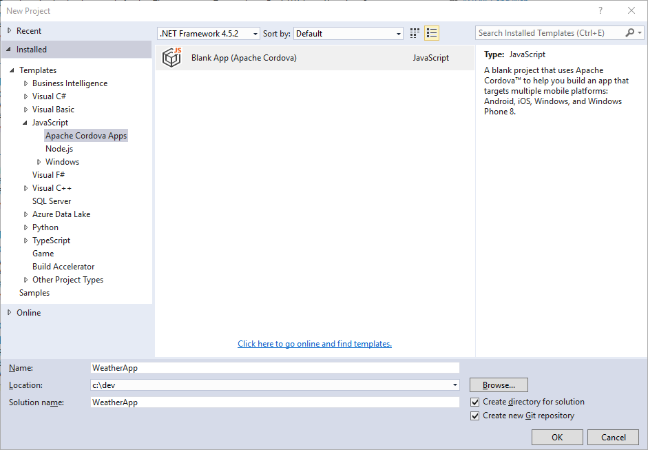

    > **Note:** If you like TypeScript, there's a template for that under **TypeScript**->**Apache Cordova Apps**.

    After you create the project, your solution should resemble the following:

    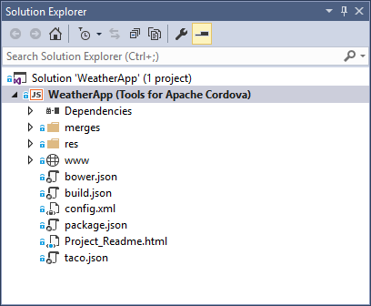

## <a id="tour-project"></a>Quick tour of the project

The Apache Cordova Blank app template includes a project structure containing a set of folders and files, detailed below.

- Root configuration files: 

    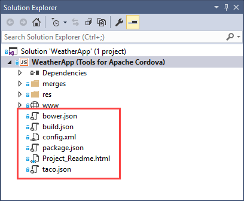

    - **bowser.json** file: Used by Visual Studio to manage the [Bower](http://bower.io/) packages dependencies of your app. For more information on adding packages to your Cordova project with the Bower Package Manager check [this article](tutorial-using-bower.md).

    - **build.json** file: Contains parameters used to build a signed Android package. Application packaging is beyond the scope of this document, find more information about packaging your Cordova apps [here](/articles/tutorial-package-publish/tutorial-package-publish-readme.md).

    - **config.xml** file:  Contains the settings of your app. In the [Find app settings](#settings) section it will be explained in further detail. 

    - **taco.json** file: Used to define which version of the [Cordova CLI](https://cordova.apache.org/docs/en/4.0.0/guide/cli/) Visual Studio should use to build the project with. This configuration can also be set in the **Platforms** page of the [Configuration designer](#settings) 
 
- **www** folder: Is where HTML, JavaScript, style sheets, and any images you want to use are located. It already contains some files, so this app can be run right out of the box. You can modify these files or add more as you build your app.

    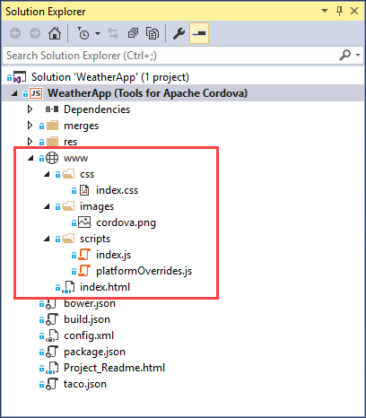

- **merges** folder: Is where HTML, JavaScript, and style sheet files that apply to **specific platforms** are located. The Visual Studio Tools for Apache Cordova template already includes support for Android, iOS, Windows and Windows Phone. 

    


- **res** folder: Is where icons, splash screens, signing certificates and any other platform-specific files are located.

    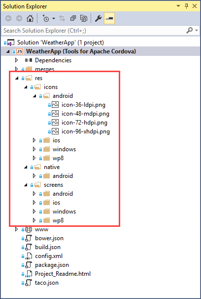

At build time, all files and folders under merges/_platform_ are copied into the final folder structure, overwriting any files with the same names in the root project. 

For example, scripts/platformOverrides.js is replaced by merges/android/scripts/platformoverrides.js on Android. This is how you can incorporate platform-specific code, if needed.


The same file-level merging also works for CSS, images and anything else. 

## <a id="run"></a>Run your app

1. On the Standard toolbar, choose the **Ripple – Nexus (Galaxy)** button.

    

    Your app opens in Apache Ripple and it looks like this because we haven't added any code yet.

    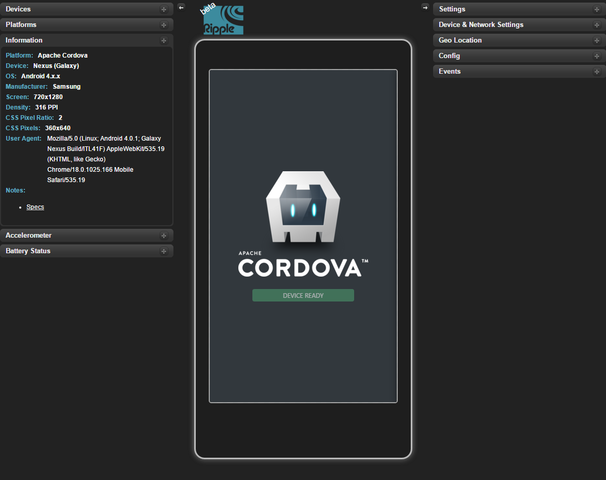

    [Apache Ripple](/articles/develop-apps/run-app-ripple-simulator.md) is a free mobile simulator. If you haven’t used it before, try a few things while you have it open. For example, change the device orientation or the platform and see how your app appears. Apache Ripple is probably the easiest way to see the effect of your changes as you develop.
    
    

2. Stop the app.

    There are many options for running your apps built using Visual Studio Tools for Apache Cordova. From Visual Studio, you can run and debug Android, iOS and Windows apps on the emulators and devices, including the Apache Ripple simulator and the Visual Studio Emulators. An emulator gives you a bit more of a realistic device experience. Find more information in the following links:
    - [Android](/articles/develop-apps/run-app-apache.md)
    - [iOS](/articles/develop-apps/run-app-ios.md)
    - [Windows](/articles/develop-apps/run-app-windows.md)
    - [Windows Phone](/articles/develop-apps/run-app-windows-phone.md)
    
    To see them all, choose any platform from the platform list on the Standard toolbar.

    

    Then, choose an emulator.

    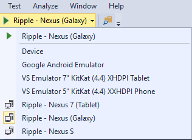

    Run your app in any of them if you want, but don't use any of the iOS emulators yet because you will need a Mac. If you don't have a Mac, you can use the Ripple simulators for testing your app on iOS.

    > **Note:** Setting up the connection between Visual Studio and the Mac is a little advanced for this guide. [This article](ios-guide.md) provides some guidance for doing that.

## <a id="settings"></a>Find app settings

Many aspects of a Cordova app's behavior can be controlled with the global configuration file, **config.xml**. This XML file is used to specify core Cordova API features, plugins, and platform-specific settings.

Visual Studio provides a Designer to change the configuration of the app, so you don't need to edit XML directly unless you want to.


## <a id="build-something"></a>Start Small: Build a basic app

Apps can be as complicated or as simple as you want them to be. The goal of this section is to build a very basic single page app that shows the weather conditions of any area in the United States.

### Add References

First, you'll add the [JQuery](https://jquery.com/) and [JQuery Mobile](https://jquerymobile.com/) libraries to the project.

If you're not familiar with _JQuery_, it's a just a JavaScript library that makes certain tasks easier such as changing the properties of a control or handling it's events, and that's exactly what we'll use it for. _JQuery Mobile_ is a touch-optimized HTML5 UI framework, built on JQuery core, designed to make responsive web sites and apps that are accessible on all smartphone, tablet and desktop devices. In this tutorial is included because it provides a quick way of styling the application without having to do custom CSS work.

1.  Download the _JQuery_ latest compressed version from [here](https://jquery.com/download/) and move the library JS file to the **scripts** subfolder of your **www** folder

    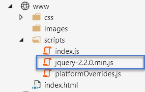

2.  Download the _JQuery mobile_ latest zipped version from [here](https://jquerymobile.com/download/) and extract the following files:
    
    - jquery.mobile-1.4.5.min.js to the **scripts** subfolder of your **www** folder
    
    - jquery.mobile-1.4.5.min.css to the **css** subfolder of your **www** folder
    
    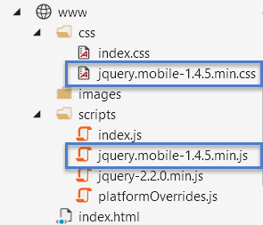

3.  Add this script reference to the `<body>` tag of your [index.html](#tour-project) file (at the bottom of the body section, where the other JavaScript references are located):

    ```html
    <script src="scripts/jquery-2.2.0.min.js"></script>
    <script src="scripts/jquery.mobile-1.4.5.min.js"></script>
    ```

4.  Add this style reference to the `<head>` tag of your [index.html](#tour-project) file, above the existing **index.css** reference:

    ```html
    <link rel="stylesheet" href="css/jquery.mobile-1.4.5.min.css" />
    ```

### Design a page

**index.html** is the first page that appears when users run your app. So we'll add our HTML to that file. 

> **Note:** You can change the app's default file in the **Start Page** setting of the [config.xml file using the configuration designer](#settings).

1. Open the **index.css** file and replace its content with the following css rules:

    ```css
    .not-displayed {
        display: none;
    }

    form {
        border-bottom: 1px solid #ddd;
        padding-bottom: 5px;
    }

    #zip-code-input {
        font-size: 25px;
    }

    #get-weather-btn {
        font-size: 22px;
    }

    #title {
        font-size: 16px;
    }

    #summary {
        font-size: 35px;
    }

    #summary img {
        float: right;
    }

    #error-msg {
        text-align: center;
        margin-top:  50%;
        font-weight: bold;    
    }
    ```
1. Open the **index.html** file and remove this line.

    ```html
    <p>Hello, your application is ready!</p>
    ```

2. Add this HTML to the ```<body>``` of the page to give users a way to search for the weather and see the results.

    ```html
    <div data-role="page" id="weather-page">

        <div data-role="header" class="header">
            <h1 id="app-title">Weather App</h1>
            <a href="/" class="ui-btn ui-btn-left ui-btn-corner-all ui-icon-home ui-btn-icon-notext" rel="external">Home</a>
        </div>

        <div role="main" class="ui-content">
            <form>
                <label for="zip-code">Type your zip code:</label>
                <input id="zip-code-input" name="zip-code" placeholder="eg. 98001" required />
                <button id="get-weather-btn" data-role="button" data-icon="search">Find Weather</button>
            </form>

            <ul id="weather-data" data-role="listview" data-inset="true" class="ui-listview ui-listview-inset ui-corner-all ui-shadow not-displayed">
                <li data-role="list-divider" id="title" class="ui-li-divider ui-bar-a"></li>
                <li><span id="summary"><span id="temperature"></span> F </span></li>
                <li>Wind: <span id="wind"></span> knots</li>
                <li>Humidity: <span id="humidity"></span> %</li>
                <li>Visibility: <span id="visibility"></span> miles</li>
                <li>Sunrise: <span id="sunrise"></span></li>
                <li>Sunset: <span id="sunset"></span></li>
            </ul>

            <div id="error-msg" class="not-displayed">
            </div>

        </div>

        <footer data-role="footer" data-position="fixed">
            <h4>Visual Studio Tools for Cordova Demo</h4>
        </footer>

    </div>
    ```

### Handle a button event

1. Open the [index.js](#tour-project) file and add the following line of code to the ```onDeviceReady``` function.

    ```javascript
    $('#get-weather-btn').click(WeatherApp.getWeather);
	```

    This code refers to the ID of the 'Get Weather' button on the HTML page and it's used to handle the `click` event by passing in the name of a function (_getWeather_). That function will be added shortly.

#### A quick look at index.js
This is a good time to quickly look at the ```index.js``` file. This file loads when the user runs the app.  Why? Because the ```index.html``` page contains this reference to it:

```javascript       
<script src="scripts/index.js"></script>
```

You'll notice a few things about the ```index.js``` file. First, all the code in that file is enclosed within an *anonymous self-invoking function* (or _Immediately Invoked Function Expression_, or _[IIFE](https://developer.mozilla.org/docs/Glossary/IIFE)_). This is a fancy way of saying that this function executes automatically when the file loads.

```javascript      
(function () {
    "use strict";
    // all the stuff is in this function.
})();
```

Enclosed in this function, you'll see an event handler that runs when the Cordova device APIs are fully loaded.  

```javascript      
function onDeviceReady() {

    // TODO: Cordova has been loaded. Perform any initialization that requires Cordova here.
};
```

So what exactly do we mean by *Cordova device APIs*? These are APIs that you'd use to interact with device capabilities such as the camera or accelerometer. If you want to run any code like this when the app first starts, make sure you add that code or call those functions from inside of this event handler. In fact, later on, we'll do just that.

### Add code to get the weather

Now we'll add the *getWeather* function that we're using to handle button's ``click`` event. But first, let's add a JavaScript file for that function.

1. In **Solution Explorer**, find the **scripts** sub-folder in your **www** folder.

    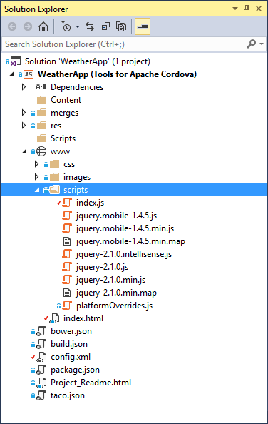

2. Right-click the **scripts** folder, and then choose **Add** -> **New JavaScript file**.

3. Name the file *weather.js*, and then choose the **Add** button.

4. Open the **weather.js** file and add the following function.

	```javascript       
    var WeatherApp = {};

    (function ($, ns, navigator) {
        ns.getWeather = function () {
            var zipcode = $('#zip-code-input').val();

            // get weather using zip code
            var queryString =
                'https://query.yahooapis.com/v1/public/yql?q='
                + 'select+*+from+weather.forecast+where+location='
                + zipcode + '&format=json';

            $.getJSON(queryString, function (results) {
                if (results.query.count > 0 && results.query.results.channel.wind) {
                    $('#error-msg').hide();
                    $('#weather-data').show();

                    var weather = results.query.results.channel;
                    $('#title').text(weather.title);

                    var wind = weather.wind;
                    $('#temperature').text(wind.chill);
                    $('#wind').text(wind.speed);

                    var atmosphere = weather.atmosphere;
                    $('#humidity').text(atmosphere.humidity);
                    $('#visibility').text(atmosphere.visibility);

                    var astronomy = weather.astronomy;
                    $('#sunrise').text(astronomy.sunrise);
                    $('#sunset').text(astronomy.sunset);

                    $('#summary img').attr('src', $(weather.item.description)[0].src);

                } else {
                    $('#weather-data').hide();
                    $('#error-msg').show();
                    $('#error-msg').text("Error retrieving data. " + results.query.results.channel.item.title);
                }
            }).fail(function (jqXHR) {
                $('#error-msg').show();
                $('#error-msg').text("Error retrieving data. " + jqXHR.statusText);
            });

            return false;
        }
        
    })($, WeatherApp, navigator);
	```

    This function gets a zip code from the input box, and uses a free service to get the weather for that zip code. The rest of this code uses JQuery syntax to populate controls on the page with data from the service.

    Now we're still missing a step. We have to refer to this new JavaScript file in our HTML page so let's do that now.

5. Open the **index.html** page, and add this reference to the ```<body>``` of the page (at the bottom of the body section, where the other JavaScript references are located).

	```html   
    <script src="scripts/weather.js"></script>
	```

    When you're done, your script reference should look something like the following.

	```html   
    <script src="scripts/jquery-2.2.0.min.js"></script>
    <script src="scripts/jquery.mobile-1.4.5.min.js"></script>
    <script src="cordova.js"></script>
    <script src="scripts/platformOverrides.js"></script>
    <script src="scripts/index.js"></script>
    <script src="scripts/weather.js"></script>
	```

6. Add ```https://query.yahooapis.com```, ```http://gws2.maps.yahoo.com``` and ```http://l.yimg.com``` to the page's Content Security Policy (CSP). The CSP is just a line of HTML that is located inside of the ```<head>``` used to declare approved origins of content that browsers should be allowed to load on your website. It looks like this:

    ```html
    <meta http-equiv="Content-Security-Policy" content="default-src 'self' data: gap:
    https://ssl.gstatic.com 'unsafe-eval'; style-src 'self' 'unsafe-inline'; media-src *">
    ```

    Add ```https://query.yahooapis.com```, ```http://gws2.maps.yahoo.com``` and ```http://l.yimg.com``` just after ```https://ssl.gstatic.com``` in that line to give this page permission to get content from the Yahoo weather service and map service. When you're done, your CSP will look like this:

    ```html
    <meta http-equiv="Content-Security-Policy" content="default-src 'self' data: gap:
    https://ssl.gstatic.com https://query.yahooapis.com http://gws2.maps.yahoo.com http://l.yimg.com 'unsafe-eval'; style-src 'self' 'unsafe-inline'; media-src *">
    ```
    
    > **Note:** Content Security Policy (CSP) is a computer security standard introduced to prevent cross-site scripting (XSS), clickjacking and other code injection attacks resulting from execution of malicious content in the trusted web page context. For more information visit http://content-security-policy.com/

## Run your app in an Emulator

Let's run the app, but this time let's use an emulator.

1. In the list of Android emulators, choose the one of the **VS Emulator 5** to run your app.

    

    > **Note:** According to your PC configuration some warnings or errors may appear, like firewall alerts or message indicating that the emulator must run in elevated mode. If you receive the following error, try killing the Android Debug Bridge process (adb.exe):
    
    > 

2. In the Android emulator, type a valid United States zip code into the edit box (for example: 98052), and then press the **Get Weather** button.

    Weather data for that region appears in the controls.

    

    What's great here is that this app is completely cross platform. If you have a little extra time, run this app in a Windows Phone emulator. For instructions on how to do this see [this article](https://msdn.microsoft.com/library/windows/apps/xaml/mt188754.aspx)

    > **Note:** You should test your app on as many physical devices (running on as many Operating System versions) as you can. Emulators and Simulators can behave different than a real device on certain circumstances and respond at different speeds. For example, an app may work in the simulator without a problem, but it may fail on a real device, or it can run faster on the device compared with an emulator. More information [here](https://cordova.apache.org/docs/en/4.0.0/guide/next/#testing-on-a-simulator-vs.-on-a-real-device).

## <a id="find-fix"></a>Find and fix problems

One of the biggest benefits of using Visual Studio is that you can take advantage of all its powerful debugging features while running your Cordova application in any of the modes that Visual Studio Tools for Apache Cordova provides, including debugging an application running on a remote device.

Among the available debugging features are:

- **Setting breakpoints and conditional breakpoints**: Breakpoints can be set on any line of executable code (including the JavaScript code), and all the available tools to look the state of the Apache Cordova application, including variable values and call stack (among others), can be used. 

 

- **Using the JavaScript console**: This console appears when your Cordova app is started, or can be displayed by selecting **Debug** -> **Windows** -> **JavaScript Console** in the Visual Studio menu. It's a common practice to add code that logs messages and then view those messages in the console, using the JavaScript `console.log` method. This console can also be used to execute any JavaScript function while the application is running. [Learn more about the JavaScript Console](https://developers.google.com/web/tools/javascript/console/).

- **Using the Document Object Model (DOM) Explorer**: Useful to find and fix layout issues in your pages by examining their structure as they render and tweak them while the app is running. It can be displayed by choosing **Debug** -> **Windows** -> **DOM Explorer** in the Visual Studio menu while the app is running. [Learn more about the DOM Explorer](https://msdn.microsoft.com/library/dn255008.aspx).
 
 
 
## <a id="capability"></a>Access a device capability

Most likely you'll want your app to do more than just show web pages on a mobile device. You might want your app to store files, receive push notifications, or capture images by using the device's camera. This is where a **plugin** becomes handy. Apache Cordova uses plugins to provide access to native device capabilities that aren’t available to simple web apps.

Some of the more commonly used plug-ins can be found in the **Core** page of the app's **[configuration designer](#settings)**.


[Cordova plugins registry](http://cordova.apache.org/plugins/) offers hundreds of other plugins. To add them, you'll have to edit the config.xml file directly. To do so, follow the instructions [here](/articles/develop-apps/manage-plugins.md/#AddOther).

Use the **Custom** page to add plugins that don't appear in the [Cordova plugins registry](http://cordova.apache.org/plugins/). These could be plugins that you or a colleague create for some specific purpose and then save to your local drive or to a GitHub repository.  [This document](/articles/develop-apps/manage-plugins.md/#Custom) explains how to add a custom plugin.

Follow these instructions to add a plug-in that gives you access to the device's geolocation system. That way, you can get the weather of a user's current location.

1. Open the [configuration designer](#settings), and choose the **Plugins** tab.

2. Choose the **Geolocation** plugin, and then choose the **Add** button. This adds the plug-in to your project.

    
    
    > **Note:** For instructions on how to use it, read the **Readme.md** file located in the selected plugin folder under the project's **plugins** folder as shown in this image.

    Let's add some code that consumes this plugin.

3. In the **weather.js** file add the following code right after the 'getWeather' function:

	 ```javascript
    ns.getLocation = function () {
        navigator.geolocation.getCurrentPosition(onGetLocationSuccess, onGetLocationError, { enableHighAccuracy: true });

        $('#error-msg').show();
        $('#error-msg').text('Determining your current location ...');

        $('#get-weather-btn').prop('disabled', true);
    }

    var onGetLocationSuccess = function (position) {
        var latitude = position.coords.latitude;
        var longitude = position.coords.longitude;

        // get zip code by using latitude and longitude.
        var queryString = 'http://gws2.maps.yahoo.com/findlocation?pf=1&locale=en_US&offset=15&flags=&q='
            + latitude + '%2c' + longitude + '&gflags=R&start=0&format=json';

        $.getJSON(queryString, function (results) {
            $('#error-msg').hide();

            if (results.Found > 0) {
                // put the zip code into the input box for the user if we get a location
                var zipCode = results.Result.uzip
                $('#zip-code-input').val(zipCode);
            }
        }).fail(function () {
            $('#error-msg').text('Error retrieving data.');
        }).always(function () {
            // always reset the UI even if we fail to get a ZIP code from the service.
            $('#get-weather-btn').prop('disabled', false);
        });
    }

    var onGetLocationError = function (error) {
        $('#error-msg').text('Error getting location. Leaving zip code field blank');
        $('#get-weather-btn').prop('disabled', false);
    }
    ```

    This code uses the device's geolocation capability to get the latitude and longitude of the device's location. With that data it gets a zip code for that location and then populate the input box with that zip code:

4.  Open the **index.js** file, and add the following code to the `onDeviceReady` function.

	```javascript  
	WeatherApp.getLocation();
	```

    The ``onDeviceReady`` function should look like this.

	```javascript
	function onDeviceReady() {
		// Handle the Cordova pause and resume events
		document.addEventListener( 'pause', onPause.bind( this ), false );
		document.addEventListener('resume', onResume.bind(this), false);
        
        $('#get-weather').click(WeatherApp.getWeather);
        WeatherApp.getLocation();
	};
	```

6. Run the app.

    When your app starts, the label *Determining your current location ...* appears. After a brief period of time, the input box shows the zip code of your current location.

    > **Note**: If you use the Apache Ripple emulator, you’ll have to configure it with your location.
    
    > 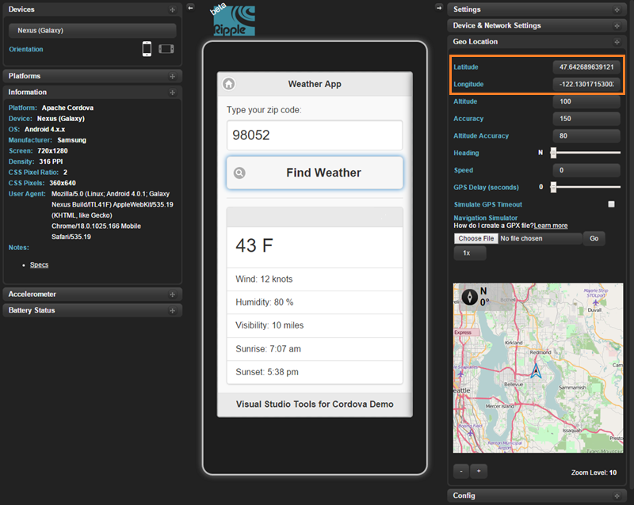

## <a id="tailor"></a>Tailor the app to a platform

The code that you used to get the device's location works pretty well across all platforms, but what if it didn't? What if you had to write extra code to get the location of an iOS device?

This is where the **merges** folder becomes useful. We touched on that folder earlier in this article. Now let's try a few basic things.

### Tailor the behavior of your app

1. In **Solution Explorer**, expand the **www** folder, and then the **scripts** folder.

2. Right-click the **weather.js** file, and choose **Copy**.

3. In **Solution Explorer**, expand the **android** sub-folder in your **merges** folder.

4. Right-click the **scripts** folder, and then choose **paste**.

    You now have a copy of the **weather.js** in the **android** folder.

    

5. In the **weather.js** file (located in the **merges/android/scripts** folder), add the following code to the ``getLocation`` method.

	```javascript
    $('#app-title').text("Android Weather");
	```

6. Run your app in the Apache Ripple Simulator.

    The app now has the title **Android Weather** because the **index.js** file in the **android** folder replaces the **index.js** file in the **www** folder for the Android version of your app.

    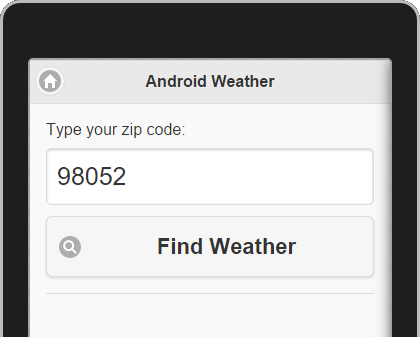

    Making a copy of a file this large to change one line of code is an extreme example, but you can begin to imagine the possibilities, and you can always refactor your code in ways that leverage the **merges** folder more efficiently.

    The readme file of each plug-in will tell you what sort of device-specific code you'll have to write.

### Tailor the appearance of your app

In some cases, you'll have to tweak the layout of your pages so that they appear correctly for one type of device or another.

1. Return to the **android** sub-folder in your **merges** folder.

2. Right-click the **android** folder, choose **Add** -> **New Folder**, and name the folder **css**.

3. Right-click the **css** folder, and then choose **Add** -> **New CSS file**.

4. Name the file *index.css*, and then choose the **Add** button.

    You now have a file named **index.css** in both the **android** folder and the **www** folder.

    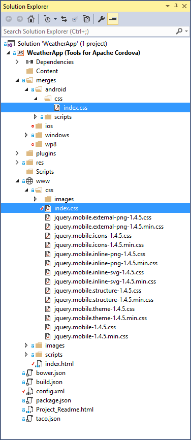

5. Replace the contents of the new **index.css** file with the following code.

	```css
    .not-displayed {
        display: none;
    }

    form {
        border-bottom: 1px solid #ddd;
        padding-bottom: 5px;
    }

    #zip-code-input {
        font-size: 25px;
    }

    #get-weather-btn {
        font-size: 22px;
    }

    #title {
        font-size: 16px;
    }

    #summary {
        font-size: 35px;
    }

    #summary img {
        float: right;
    }

    #error-msg {
        text-align: center;
        margin-top:  50%;
        font-weight: bold;    
    }

    .ui-bar-inherit.ui-header.header {
        background-color: #3388cc;
        border-color: #3388cc;
        color: #ffffff;
        text-shadow: 0 1px 0 #005599;
    }
	```
    
    Note that the styles defined are identical to the **www** version of the _index.css_ file, with the exception of these element:
    
    ````css
    .ui-bar-inherit.ui-header.header {
        background-color: #3388cc;
        border-color: #3388cc;
        color: #ffffff;
        text-shadow: 0 1px 0 #005599;
    }
    ````
    
    Again, this is a simple example of what can be achieved using the **merge** folder. A more effective approach would be using a separate css file for platform-specific styles.

6. Run your app in the Apache Ripple Simulator.

    The app header has a blue background because the **index.css** file in the **android** folder replaces the **index.css** file in the **www** folder for the Android version of your app.

    


## <a id="next-steps"></a>Next steps

Congratulations on building your first cross-platform mobile app. Although this topic gets you started, there’s so much more to learn.

Here are a few ideas about what you can explore next on your journey to build mobile apps with HTML and JavaScript and Visual Studio.

**Explore the plug-in registry**

see [Search Cordova Plugins](http://cordova.apache.org/plugins/).

> **Tip:** If find a plugin that doesn't appear in the **Plugins** tab of configuration designer, you can still use it. [Learn more](./develop-apps/manage-plugins.md##AddOther).

**Try using Bower to add a package to your project**

see [Add packages by using Bower](tutorial-using-bower.md).

**Learn about other great ways to leverage the Visual Studio debugger**

see [Debugger Basics](https://msdn.microsoft.com/library/k0k771bt.aspx).

**Explore the many JavaScript frameworks out there**

Search online. They're everywhere! Here's a couple of them: [AngularJS](https://angularjs.org/), and [ionic](http://ionicframework.com/).

**Get a Mac and then run your app in an iOS emulator, or on an iOS device**

See [Setup guide: Target iOS mobile devices in a Visual Studio Tools for Apache Cordova project](ios-guide.md).

**Tack on an Azure backend - it's free to try**

see [Connect a cloud service](./develop-apps/add-connected-services.md).

**Take a look at TypeScript - it's fully supported in your project**

see [Use TypeScript](./develop-apps/tutorial-typescript.md).
