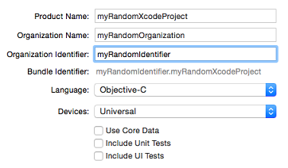
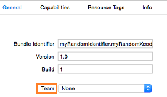
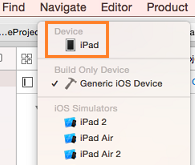
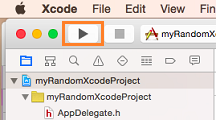

<properties
   pageTitle="Setup guide: Target iOS mobile devices in a Visual Studio Tools for Apache Cordova project | Cordova"
   description="description"
   services="na"
   documentationCenter=""
   authors="normesta"
   tags=""/>
<tags
   ms.service="na"
   ms.devlang="javascript"
   ms.topic="article"
   ms.tgt_pltfrm="mobile-multiple"
   ms.workload="na"
   ms.date="12/08/2015"
   ms.author="normesta"/>

# Setup guide: Target iOS mobile devices in a Visual Studio Tools for Apache Cordova project

If you want to build an iOS version of your app, you'll need a Mac to do it. Currently, there is no way to build an iOS app without one. You can use a physical Mac or a cloud-hosted one. Just make sure that it's running Mac OS X Mavericks or later.

In this guide, we'll help you get everything setup right so that you can build, run, and debug your app. We'll stop a few times to check and see if everything is working as expected. If something isn't behaving, we'll propose a few ideas that have worked for others.

Let's help you set things up.

## Install a few things onto your Mac

1. Install [Node.js](http://nodejs.org/).

2. Install [Xcode](https://developer.apple.com/xcode/download/).

3. In the **Launchpad**, open **Xcode**.

    

4. Accept the license agreement and then close Xcode.

    This seems like a strange step, but our tools depend on Xcode and it won't run until you this license.

4. Open a Terminal app, and type this command.

    ```
     xcode-select -–install
    ```
    This installs the Xcode command-line tools.

4. In the Terminal app, type this command.

    ```
     sudo npm install -g remotebuild
    ```

   This installs the *remote agent*. It's a secure build server that you run on your mac. You'll connect to it from your Windows computer so that you can build, run, and debug iOS apps in Visual Studio.

## <a id="remoteAgent"></a>Start the remote agent on your Mac

You can start the remote agent in secure mode or without secure mode.

### Option 1: Start the remote agent (secure mode)

This is the safest mode. Visual Studio uses SSL certificates to securely transfer build payloads to the remote agent. This mode protects your intellectual property from being intercepted because your build payload is encrypted. It also reduces the likelihood that outsiders will use the open port of your remote agent to run malicious code. When you start the agent in secure mode, you'll get a PIN. The only way to establish a connection with the remote host is by using that PIN.  

To start the remote agent in secure mode, type this command.

```
 remotebuild
```

The agent installs [Homebrew](http://brew.sh/), and then starts. The host name, port number, and security pin appear in the Terminal app.  


You'll use those pieces of information in the next section. In fact, you'll want to do that part fairly soon because the security pin is active for only 10 minutes.

### Option 2: Start the remote agent (without secure mode)

This is the easiest yet riskiest way to start the remote agent. Visual Studio uses simple HTTP connections to transfer build payloads. Often times when folks have trouble connecting Visual Studio to their remote agent, they'll start their remote agent without secure mode and the connection issue disappears.

Start the remote agent without secure mode only if you are comfortable with the trade-offs between risk and convenience. For example, if your Mac is publically accessible over the internet and has access to sensitive materials, you'll probably want to run your remote agent in secure mode. If your mac is accessible only to you, it's easier and less error prone to run your remote agent without secure mode.  

To start the remote agent **without** secure mode, type this command

```
 remotebuild --secure false
```

The agent installs [Homebrew](http://brew.sh/), and then starts. The host name, and port number appear in the Terminal app.  

You'll use those pieces of information in the next section.

## <a id="getInfo"></a>Connect Visual Studio to the remote agent

1. On your Windows computer, open Visual Studio.

2. On the Visual Studio menu bar, choose **Tools**->**Options**.

4. In the **Options** dialog box, open **Tools for Apache Cordova**, and then choose **Remote Agent Configuration**.

    

5. Add the host name and port number to the appropriate fields in this dialog box.

6. If your using secure mode, set the **Secure mode** field to **True**, and then add the security pin.

    

    If your not using secure mode, set the **Secure mode** filed to **False**, and then leave the **Security PIN** field blank.

    

5. Choose the **OK** button to close this dialog box.

    Visual Studio connects to the remote agent. If you don't receive any errors, you've successfully connected.

### Troubleshooting: Let's fix it

[Did you receive an error that relates to your certificate?](#certificates)

[Is the host name of your Mac not resolving?](#hostname)

[Have you been told that your security PIN invalid or has expired?](#securitypin)

[Are you experiencing a symptom that does not appear in this list?](#stack)

## Run your app in an iOS simulator

1. On the Standard toolbar, choose the **iOS** platform.

    

2. Choose **iPhone 5** simulator.

    

3. Press the F5 key to start the app.

    As your app builds, you'll see messages appear in the Terminal app on your mac. This means that Visual Studio has successfully connected to the remote agent and is using that agent to build and deploy your app to the mac.

    When the build is complete, your app will appear in the iPhone 5 simulator on your Mac.

### Troubleshooting: Let's fix it

[Did you receive an error that relates to your certificate?](#certificates)

[Is the host name of your Mac not resolving?](#hostname)

[Have you been told that your security PIN invalid or has expired?](#securitypin)

[Are you experiencing a symptom that does not appear in this list?](#stack)

## Create a provisioning profile

You'll need a *provisioning profile* to run your app on a device.

If you use Xcode 7, you can get a provisioning profile by using your free Apple ID. That way you can build, run, and debug your app on a device with the least amount of hassle. That said, there are limitations. To learn about them, see [Supported Capabilities](https://developer.apple.com/library/prerelease/ios/documentation/IDEs/Conceptual/AppDistributionGuide/SupportedCapabilities/SupportedCapabilities.html#//apple_ref/doc/uid/TP40012582-CH38-SW1). Also, you'll have to connect your device to a Mac. You can't connect a device directly to a Windows computer.

If you want the most flexible type of provisioning profile, you'll want to create it by using an Apple Developer account.

### Create a provisioning profile by using your free Apple ID

1. Start Xcode 7.

2. In Xcode 7, add your Apple ID.

    See [Adding an Apple ID to Your Accounts](https://developer.apple.com/library/ios/recipes/xcode_help-accounts_preferences/articles/add_appleid.html).

3. In Xcode 7, choose **File**->**New**->**Project**.

4. In the **Choose a template for your new project** dialog box, choose the iOS Application category of templates, choose any template, and then choose the **Next** button.

    

5. Name your product, organization, and identifier anything you want, and then choose the **Next** button.

    

6. Choose a location to save your project, and then choose the **Create** button.

    The **General** page of the project properties appears.

7. In the **Team** pop-up menu, choose your Apple ID.

    

8. Connect your device to your Mac. Make sure that  your device is turned on.

9. In the **Scheme** pop-up menu, choose your device.

    

    If the device has the message **version lower than deployment target**, you can either update the operating system of your device or choose a version of iOS from the **Deployment Target** pop-up menu that matches the operating system version of your device.

10. If a **Fix Issue** button appears below the **Team** pop-up menu, choose that button.

    Xcode creates a provisioning profile and the **Fix Issue** button disappears.

11. Choose the **Run** button to run your project.

    

    Running your project, ensures that your provisioning profile works. Xcode installs your blank app to the device and then starts it.

#### Troubleshooting: Let's fix it

Did something not behave as expected? See these more detailed articles on the Apple Developer website. Please let us know if we are missing an important step.

* [Creating a project in Xcode 7](https://developer.apple.com/library/ios/documentation/IDEs/Conceptual/AppStoreDistributionTutorial/Setup/Setup.html#//apple_ref/doc/uid/TP40013839-CH41-SW1)

* [Adding your Apple ID](https://developer.apple.com/library/ios/documentation/IDEs/Conceptual/AppStoreDistributionTutorial/AddingYourAccounttoXcode/AddingYourAccounttoXcode.html#//apple_ref/doc/uid/TP40013839-CH40-SW1)

* [Creating a team provisioning profile](https://developer.apple.com/library/ios/documentation/IDEs/Conceptual/AppStoreDistributionTutorial/CreatingYourTeamProvisioningProfile/CreatingYourTeamProvisioningProfile.html#//apple_ref/doc/uid/TP40013839-CH33-SW4).

* [Starting your app on the device](https://developer.apple.com/library/ios/documentation/IDEs/Conceptual/AppStoreDistributionTutorial/LaunchingYourApponDevices/LaunchingYourApponDevices.html#//apple_ref/doc/uid/TP40013839-CH34-SW1)


### Create a provisioning profile by using an Apple Developer account

use this link for downloading accounts in XCode - https://developer.apple.com/library/ios/recipes/xcode_help-accounts_preferences/articles/obtain_certificates_and_provisioning_profiles.html#//apple_ref/doc/uid/TP40013306-CH19-SW1

## Run your app on a device

### Connect the device to a Mac


#### On your Mac

1. Connect a device (if you haven't done so already).

2. Make sure that your device is turned on.

3. Make sure that the remote agent is running.

    See [Start the remote agent on your mac](#remoteAgent).


#### On your Windows computer

1. In Visual Studio, open the project for your app.

2. On the Standard toolbar, choose the **iOS** platform.

    

3. Choose **Remote Device**.

    

4. Press the F5 key to start your app.

    Visual Studio builds your app by connecting to the remote agent on your mac. When the build is complete, your app appears on the device that is connected to your mac.

### Troubleshooting: Let's fix it

[You've been told that we were unable to find the app you're trying to debug](#safari)

[Did you receive an error that relates to your certificate?](#certificates)

[Is the host name of your Mac not resolving?](#hostname)

[Have you been told that your security PIN invalid or has expired?](#securitypin)

[Are you experiencing a symptom that does not appear in this list?](#stack)

### Connect the device to a Windows computer

Put Leo's cool stuff in here.

* [Apple iTunes](http://www.apple.com/itunes/).

You'll also need these things.

### Troubleshooting: Let's fix it

- Check to see that you have XCode installed. If you accepted the blah prompt, you'll install the command-line tools but not XCode. Go to blah and install it. Then, open XCode to accept the license agreement and restart remoteBuild.

- If you install XCode from this prompt. exit remoteBuild, open XCode and accept the license agreement. Then restart remotebuild.

- Your computer went to sleep and the network that your PC has connected to is different than your corporate network. Change the preferred networks

- Still not working? Let us know? add a DISCUSS comment below.

- Ensure that you are targetting a version of Cordova that is supported by remoteBuild. The earliest version you can use is 4.3. Open your Config.xml and make sure that your CLI version is higher. Link folks to the CLI upgrade topic that I plan to write so that they can evaluate the risks. Link to stack question where I learned about this - http://stackoverflow.com/questions/33844896/vs-2015-tools-for-apache-cordova-ios-remote-build-not-using-buildserver

If build hangs or does not execute - make sure that your node.js version and Cordova version are compatable. Here is link to the known issues article - http://taco.visualstudio.com/en-us/docs/known-issues-general/#strongbuild-hangs-or-does-not-execute-when-building-for-ios-with-cordova-lt-533-and-nodejs-400strong and a link to the stack article - http://stackoverflow.com/questions/33791687/ios-remote-build-fails-in-visual-studio-taco

## Stop the remote agent on your Mac

In the Terminal app on your Mac, press Ctrl+C.

## Troubleshooting: Let's fix it

### <a id="certificate">Did you receive an error that relates to your certificate?

This can happen when Visual Studio has trouble finding your Mac on the network.

On your Windows computer, open a **Command Prompt**, and *ping* the IP address of your Mac. For example, if the IP address of your mac is 10.83.51.174, you'd type ```ping 10.83.51.174```.

If you don't receive any return messages in the **Command Prompt** window, your Mac and your Windows computer might be connected to different networks.

This can happen sometimes when your company has more than one Wi-Fi network.  When a Mac wakes from a sleep, it connects to the first available Wi-Fi network. That might not be the network of your Windows computer.

This image shows a preferred order of Wi-Fi networks.


The **MSFTCORP** Wi-Fi network appears first. When this Mac wakes from a sleep, it will to it.

The network that is used by your Windows Computer should appear first in this list. Otherwise, you'll experience these issues intermittently.

Still not working? Reach out to us [here](http://stackoverflow.com/questions/tagged/visual-studio-cordova).

If you've resolved this problem another way, please share it in a comment.

[Go back up](#errors)

### <a id="hostname">Is the host name of your Mac not resolving?

First, make sure that the **Host** name in Visual Studio matches computer name in the in the **Sharing** settings of your Mac.


Alternatively, you can set the **Host** name in Visual Studio to the IP address that appears in the **Network** settings of your Mac.

-- show image here - need to get that from work.

Still not working? Reach out to us [here](http://stackoverflow.com/questions/tagged/visual-studio-cordova).

If you've resolved this problem another way, please share it in a comment.

[Go back up](#errors)

### <a id="securitypin">Have you been told that your security PIN is invalid or has expired?

This can happen the first time you set things up. When you first start the remote agent, your security PIN is good for only 10 minutes. then it expires. Just generate a new one.

1. First, stop the remote agent. On your Mac, open a Terminal app, and type CTRL+C to stop it.

2. In the Terminal app, type ```remotebuild certificates generate```.

    Your new security PIN appears in the Terminal app window. Add that PIN to the **Security PIN** field in Visual Studio.

    If this doesn't work, return to your Mac and in the Terminal app, type ```remotebuild certificates reset``` and then type ```remotebuild certificates generate``` to get another PIN number.

Still not working? Reach out to us [here](http://stackoverflow.com/questions/tagged/visual-studio-cordova).

If you've resolved this problem another way, please share it in a comment.

[Go back up](#errors)

### <a id="safari"> You've been told that we were unable to find the app you're trying to debug

On your device, open the Safari settings and enable the **Web Inspector** setting.

See [Safari iOS](https://developer.apple.com/library/mac/documentation/AppleApplications/Conceptual/Safari_Developer_Guide/GettingStarted/GettingStarted.html#//apple_ref/doc/uid/TP40007874-CH2-SW8).

If this doesn't work, reset the settings on your ios device - show screenshot of that setting. Then, enable the Web Inspector setting.

### <a id="stack">Are you experiencing a symptom that does not appear in this list?

Please reach out to us [here](http://stackoverflow.com/questions/tagged/visual-studio-cordova) or start a discussion at the bottom of this topic.

[Go back up](#errors)

##### Not sure I need bucket

##### Install these things on your Mac


* An active [Apple Developer Program](https://developer.apple.com/programs/enroll/).

* An [iOS provisioning profile](https://developer.apple.com/library/ios/documentation/IDEs/Conceptual/AppDistributionGuide/MaintainingProfiles/MaintainingProfiles.html#//apple_ref/doc/uid/TP40012582-CH30-SW61) that you [download ](https://developer.apple.com/library/ios/documentation/IDEs/Conceptual/AppDistributionGuide/MaintainingProfiles/MaintainingProfiles.html#//apple_ref/doc/uid/TP40012582-CH30-SW26) in Xcode.

* A signing identity that you [configure ](https://developer.apple.com/library/ios/documentation/IDEs/Conceptual/AppDistributionGuide/MaintainingCertificates/MaintainingCertificates.html#//apple_ref/doc/uid/TP40012582-CH31-SW4) in Xcode.

##### Configure npm package cache permissions

If you have an older version of Node.js and npm, type this command:

```
sudo chown -R `whoami` ~/.npm
```

Newer versions of Node.js and npm will automatically configure the permissions of the npm package cache in your home directory.

If you pass this don't worry, you can reinstall the command-line tools by doing this:

To install these, open a Terminal app on your Mac, and type this command: ```xcode-select -–install```.

#### An error occurs when you attempt to use local or remote device build

Make sure you have XCode 7 installed. This prevents you from having to use a provisioning profile and apple developer account to build and debug your apps.

#### Explore configuration files - show how to save the settings, about the default settings, and some of the other commands that you can use
