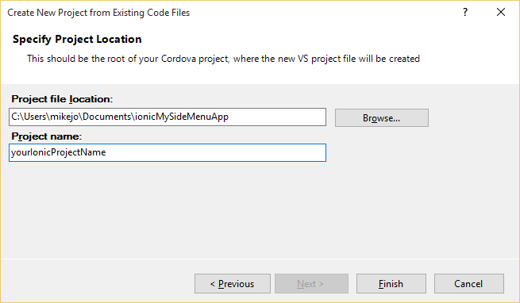
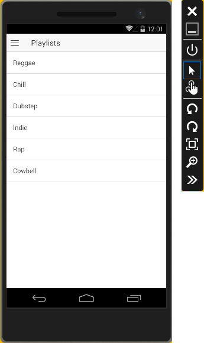
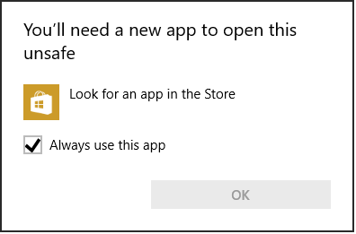

<properties pageTitle="Getting started with Ionic apps in Visual Studio"
  description="This is an article on ionic tutorial"
  services=""
  documentationCenter=""
  authors="mikejo5000" />
  <tags
     ms.service="na"
     ms.devlang="javascript"
     ms.topic="article"
     ms.tgt_pltfrm="mobile-multiple"
     ms.workload="na"
     ms.date="12/01/2015"
     ms.author="mikejo"/>

# Get started with Ionic apps in Visual Studio
[Ionic](http://www.ionicframework.com) is a popular front-end JavaScript framework for developing cross-platform mobile apps using Cordova. You can use Visual Studio 2015 and the Ionic CLI to easily create and debug cross-platform apps.

>**Note**: For a video walkthrough that shows similar steps, see the [Video tutorial](http://go.microsoft.com/fwlink/p/?LinkID=534728).

## Set up your machine for Ionic with VS <a name="getStarted"></a>

To follow these steps, you must:

1. [Install Visual Studio 2015](http://go.microsoft.com/fwlink/?LinkID=533794).

    When you install Visual Studio, make sure you include the optional components, **HTML/JavaScript (Apache Cordova)** under Cross-Platform Mobile Development.

2. To run a quick test of your setup, verify that you can run the default Blank App template.

    * In Visual Studio, choose **File**, **New**, **Project**, **JavaScript**, **Apache Cordova Apps**, **Blank App** and name the new project "blank".

    * Choose **Windows**, **Local Machine** and press F5 to run the app (make sure the app loads correctly). If any issues occur, see [Configure the Tools](configure-vs-tools-apache-cordova.md).  

3. [Install the Ionic CLI](http://ionicframework.com/docs/cli/install.html).

    ```
    npm install -g ionic
    ```

## Get the Ionic starter app templates <a name="getTemplates"></a>

1. Make sure you installed the Ionic CLI, then open a command line.
2. Go to the directory where you want to install the Ionic starter app templates, such as the Documents folder.

    ```
    C:\\Users\<username>\Documents>
    ```

3. In the command line, type

    ```
    ionic start ionicMySideMenu sidemenu
    ```

    Ionic creates the project in your current folder.

4. Use the same command to install more templates, such as:

    ```
    ionic start ionicMyTabs tabs
    ionic start ionicMyBlank blank
    ```
>**Note**: If you are trying to use a Visual Studio 2013 Ionic project in Visual Studio 2015 (recommended), see this info on [migrating projects](migrate-to-vs2015.md) to Visual Studio 2015.

## Import the project into VS <a name="configTemplates"></a>

For each of the Ionic starter app templates that you installed and want to run, do this:

1. In Visual Studio, choose **File**, **New**, **Project From Existing Code**.
2. In the wizard, choose **Apache Cordova** as the project type that you'd like to create, and then choose **Next**.

    

3. For the **Project file location**, browse to the root folder of the Ionic project and select it.

    

4. Type a name for your new project and select **Finish**.

    Visual Studio adds a few new files to the project. Wait for Bower/NPM updates to the project to finish, if necessary.

## Get your app running on Android <a name="configAndroid"></a>

1. If you want to use the Ionic CLI to add the Android platform, use this command in the command line:

    ```
    ionic platform add android
    ```

    Or, you can add the platform by building in VS (choose **Build** > **Build Solution**).

2. Choose **Android** as a debug target (Solution Platforms list), and to get the app running choose a target such as Ripple (Chrome required) or the **VS Emulator 5" KitKat (4.4)** (Hyper-V required).

    

3. Press F5, and the app should load correctly.

    

### Troubleshooting: Let's fix it

[Keyboard or StatusBar plugin not found?](#keyboard)

[TypeScript errors?](#typescript)

[Visual Studio Emulator for Android won't run?](#vsAndroidEmu)

[Error saying that a Content Security Policy is missing?](#csp)

[Other issues?](#other)

## Get your app running on iOS <a name="configiOS"></a>

  You can run initially on the Ripple Emulator after selecting iOS as a debug target, but for detailed info on setting up the remotebuild agent for iOS, see [this topic](install-vs-tools-apache-cordova.md#ios).

  The Ionic starter app should run correctly on iOS when the remotebuild agent is running on a Mac, and when Visual Studio is configured to connect to it. (The complete steps are outside the scope here.)

## Get your app running on Windows 10

To target Windows 10 in your app, you need to:

1. Use the Visual Studio install program to install the **Universal Windows App Development Tools** (optional software).

2. In the Platforms tab of the configuration designer, enter 5.4.1 (or 5.3.3) as the Cordova version.

3. Choose **Build Solution** from the **Build** menu.

4. In the configuration designer, choose Windows, and in the **Windows Target Version**, choose  **Windows 10.0**, and save changes.

5. Choose a Windows 10 deployment target, such as **Mobile Emulator 10.0.xxxxx.0 WVGA 4 inch 1GB**.

6. Press F5 to run your app.

### Troubleshooting: Let's fix it

[Keyboard or StatusBar plugin not found?](#keyboard)

[TypeScript errors?](#typescript)

[Partial pages don't load](#partialpages)

[Error saying that a Content Security Policy is missing?](#csp)

[Certificate error on Windows](#certificate)

[Unhandled exception running on Windows?](#unhandled)

[Other issues?](#other)

## Get your app running on Windows 8 or 8.1 <a name="configWindows"></a>

1. Open the folder for the Blank App project created in Visual Studio and copy the merges folder (and its contents) to your Ionic project. Copy the folder under the top level folder (for example, under ionicMySideMenu folder).

    When you complete the next few steps, you will resolve errors loading partial pages by using the winstore-jscompat.js shim.

2. In the Ionic project, create a **scripts** folder under www, and copy platformOverrides.js from the Blank App project's `www\scripts` folder to the new scripts folder.

    

3. In the Ionic project, add the following script reference to index.html, just before the Ionic Framework reference (before the ionic.bundle.js reference):

    ```
    <script src="scripts/platformOverrides.js></script>
    ```

    >**Note**: If you use the js folder instead of scripts, the folder and path will need to be updated in several other files.

4. Select **Windows** or **Windows Phone (Universal)** as a debug target (Solution Platforms list).

  * For Windows, choose **Local Machine** as the deployment target (if you are running on Windows 8.1).

  * For Windows Phone 8.1, choose one of the Emulator 8.1 options.

5. Press F5 to start debugging.

### Troubleshooting: Let's fix it

[Keyboard or StatusBar plugin not found?](#keyboard)

[TypeScript errors?](#typescript)

[Partial pages don't load](#partialpages)

[Error saying that a Content Security Policy is missing?](#csp)

[Certificate error on Windows](#certificate)

[WWAHost runtime error?](#wwahost)

[Unhandled exception running on Windows?](#unhandled)

[Other issues?](#other)

## What's Next?

You can use Visual Studio's build and [debug tools](../debug-and-test/debug-using-visual-studio.md), use the configuration manager to easily [add device plugins](../develop-apps/manage-plugins.md) to your app to get up and running quick. To learn more about Ionic, see the Ionic framework docs.


## Troubleshooting: Let's fix it

A few errors are fairly common in the starter templates when debugging in Visual Studio.

### <a id="keyboard"></a> Keyboard or StatusBar plugin not found?

If you're running in Ripple using some of the Ionic starter app templates, you may get an error on Keyboard or StatusBar plugin code running in app.js, such as the following code.

```
if (window.cordova && window.cordova.plugins.Keyboard) {
  ...
}
```

Ripple does not support custom plugins like the Keyboard plugin. We recommend you run on other devices such as the Android emulator. For more info and workarounds for Ripple, see [this post](https://github.com/driftyco/ionic-plugin-keyboard/issues/18).

> **Note**: Some APIs used in the templates for the Keyboard plugin are iOS only, like `hideKeyboardAccessoryBar`.

### <a id="typescript"></a>TypeScript errors?

In some of the Ionic starter app templates, you may also need to remove the TypeScript file, angular-ui-router.d.ts, for the angular-ui-router module, or you may see this error.


> **Note** If you are using TypeScript, you need to get updated d.ts files or an updated version of the template to support the routing module.

### <a id="wwahost"></a>WWAHost runtime error?

When debugging on a Windows 8.1 dev machine, you may get a WWAHost runtime error when navigating between pages in Ionic apps. You can work around this by:

* Closing DOM Explorer before navigating pages, or

* Upgrading to Windows 10 on your dev machine (issue is fixed in Win10).

### <a id="partialpages"></a>Partial pages don't load?

When you are using the AngularJS routing module (Ionic starter templates often use this module), you may need to include a call to `aHrefSanitizationWhitelist`.

If you see the dialog box shown here, you have likely run into this issue.



Typically, you include the code fix in app.js or wherever you are calling your module configuration code:

```
$compileProvider.aHrefSanitizationWhitelist(/^\s*(https?|ftp|mailto|file|ghttps?|ms-appx|ms-appx-web|x-wmapp0):/);

$compileProvider.imgSrcSanitizationWhitelist(/^\s*(https?|ftp|file|ms-appx|ms-appx-web|x-wmapp0):|data:image\//);
```
If you use the preceding code, then add a reference to $compileProvider in the following line of code.

```
.config(function ($stateProvider, $urlRouterProvider) {
  ```

so that it looks like this:

```
.config(function ($compileProvider, $stateProvider, $urlRouterProvider) {
  ```

### <a id="unhandled"></a>Unhandled exception running on Windows?

If you see the following unhandled exception when targeting Win/WinPhone 8.1, follow the [earlier steps](#configWindows) to call platformOverrides.js to fix this issue.


If you see the same error when targeting Windows 10, make sure you set **Windows 10.0** as the target in the Windows tab of the configuation designer.

### <a id="csp"></a> Error saying that the Content Security Policy is missing?

Visual Studio will use the Cordova Whitelist plugin by default, so you need to update index.html in the Cordova app with the following <meta> element:

    ```
    <meta http-equiv="Content-Security-Policy" content="default-src 'self' data: gap: https://ssl.gstatic.com 'unsafe-eval'; style-src 'self' 'unsafe-inline'; media-src *">
    ```

### <a id="certificate"></a> Certificate error on Windows?

Make sure your credentials are up to date. Check for any notifications or warning icons in the upper right of Visual Studio.


You may need to re-enter your credentials. If the notifications indicate that you need to update Cordova tooling, please click on the notifications and follow instructions.

### <a id="vsAndroidEmu"></a> Visual Studio Emulator for Android won't run?

The VS Emulator for Android requires Hyper-V and is not supported when running on a VM. For more info, see [this information](https://msdn.microsoft.com/en-us/library/mt228282.aspx#NoStart2).

If you have previously run the VS Emulator for Android successfully but now the emulator won't run, try deleting the emulator VM instance in Hyper-V Manager. For more info, see [Troubleshooting] (https://msdn.microsoft.com/en-us/library/mt228282).

### <a id="other"></a> Other issues?

If you have errors running the Blank App template (rather than just the Ionic starter apps), try these steps.

1. In Visual Studio, go to **Tools**, **Options**, **Tools for Apache Cordova** and run the Dependency Checker.

    If the Dependency Checker finds any issues for a platform that you're targeting, you will need to fix them. If you need to install the Android SDK, use the [Android SDK Manager](http://taco.visualstudio.com/en-us/docs/configure-vs-tools-apache-cordova/#ThirdParty) to install API19 and API22.

2. If you see an error message in the Output window in Visual Studio, use any links provided to try to resolve the issue.

3. If that doesn't resolve issues, follow instructions to [clear the Cordova cache](http://taco.visualstudio.com/en-us/docs/configure-vs-tools-apache-cordova/#vstac). Otherwise, see [Known Issues](http://taco.visualstudio.com/en-us/docs/known-issues-general/) or post questions on [StackOverflow](http://stackoverflow.com/questions/tagged/visual-studio-cordova).
