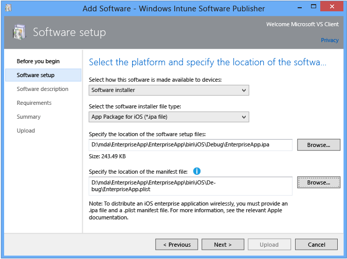

<properties
   pageTitle="Publish your app built with Visual Studio Tools for Apache Cordova | Cordova"
   description="description"
   services="na"
   documentationCenter=""
   authors="normesta"
   tags=""/>
<tags
   ms.service="na"
   ms.devlang="javascript"
   ms.topic="article"
   ms.tgt_pltfrm="mobile-multiple"
   ms.workload="na"
   ms.date="11/13/2015"
   ms.author="normesta"/>

# Publish your app built with Visual Studio Tools for Apache Cordova

First, review the app guidelines for each store, and then publish your app.

## Review the app guidelines for each store

Before you attempt to publish your app to an app store, have a look at what sorts of criteria each store uses to evaluate your app. You might find something that you have to change in your app before it will be accepted by the store. The sections below contain links to articles that can help you increase the likelihood that your app gets accepted.

## Google Play (Android)

[Launch Checklist](http://developer.android.com/distribute/tools/launch-checklist.html)

Google provides an extensive and detailed checklist for getting your app ready for distribution.

[Core App Quality](http://developer.android.com/distribute/essentials/quality/core.html)

This topic lists an extensive array of tests your app should pass before submission to Google Play.

## The Apple App Store (iOS)

[Common App Rejections](https://developer.apple.com/app-store/review/rejections/)

[App Store Review Guidelines](https://developer.apple.com/app-store/review/guidelines/)

[UI Design Dos and Don'ts](https://developer.apple.com/design/tips/)

**Related blog posts:**

[PhoneGap, Apple Rejections & UI/UX Guidelines](http://www.tricedesigns.com/2012/10/03/phonegap-apple-rejections-uiux-guidelines/)

[iOS App Store Approval Tips and Tricks](http://blogs.telerik.com/appbuilder/posts/13-05-16/ios-app-store-approval-tips-and-tricks)

[Rejected: How to Guarantee Your App Won't Get Approved | PhoneGap Day EU 2013](http://www.youtube.com/watch?v=-xIugmJ6ks4)

[PhoneGap and the Apple Store](http://www.awesome-robot.com/article/PhoneGap_and_the_Apple_Store/)

[HOWTO: Create native-looking iPhone/iPad applications from HTML, CSS and JavaScript](http://matt.might.net/articles/how-to-native-iphone-ipad-apps-in-javascript/)

[Create an Apache Cordova App – Build a UI](../getting-started/create-first-app-using-vs-tools-apache-cordova.md#BuildUI)

## The Windows Phone Store

[Windows and Windows Phone Store Policies](https://msdn.microsoft.com/library/windows/apps/dn764944.aspx)

[Microsoft Design Priniciples](https://msdn.microsoft.com/library/windows/apps/hh781237.aspx)

## Publish your app

You'll need app packages for each version of your app that you want to publish. You can find them in the **bin** folder in the Visual Studio project directory.

If you haven't created your packages yet, learn more here: [Package Your App Built with Visual Studio Tools for Apache Cordova](package-app-built-with-visual-studio.md).

Each store has guidance for how to upload your package.  

*   For Google Play, see [Upload & distribute apps](https://support.google.com/googleplay/android-developer/answer/113469?hl=en).

*   For iOS, use the Application Loader to submit your app to the App Store. See [Using Application Loader](https://itunesconnect.apple.com/docs/UsingApplicationLoader.pdf).

*   For Windows, see [Using the Windows Store Dashboard](https://msdn.microsoft.com/library/windows/apps/hh967767.aspx).

*   For Windows Phone, see [Submit your app](https://msdn.microsoft.com/library/windowsphone/help/jj206724.aspx).

Although the process of uploading your app to a public store varies by store type and platform, consider using [Windows Intune](https://www.microsoft.com/server-cloud/products/windows-intune/default.aspx#fbid=Zjhx4IFbY3b). It's an excellent cross-platform internal app store for Android, iOS, Windows, and Windows Phone. You can upload your app to Windows Intune by using [Microsoft System Center](https://www.microsoft.com/server-cloud/products/system-center-2012-r2/default.aspx#fbid=Zjhx4IFbY3b) and the Windows Intune management console, shown here.

Follow the steps described in [Deploy software to mobile devices in Windows Intune](https://technet.microsoft.com/library/dn646972.aspx) to publish a software installer for each device type (Android, iOS, Windows Phone, and Windows).

For your convenience, the `vs-mda-remote` agent also creates a Wireless Manifest plist file. You can use this file to upload your iOS app to Windows Intune. The plist file can be found in the bin folder with your IPA (.ipa) file after you build your app in Visual Studio. You can also modify this file manually.

 [Get the Visual Studio Tools for Apache Cordova](http://aka.ms/mchm38) or [learn more](https://www.visualstudio.com/cordova-vs.aspx)
