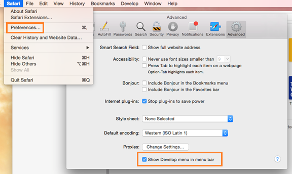
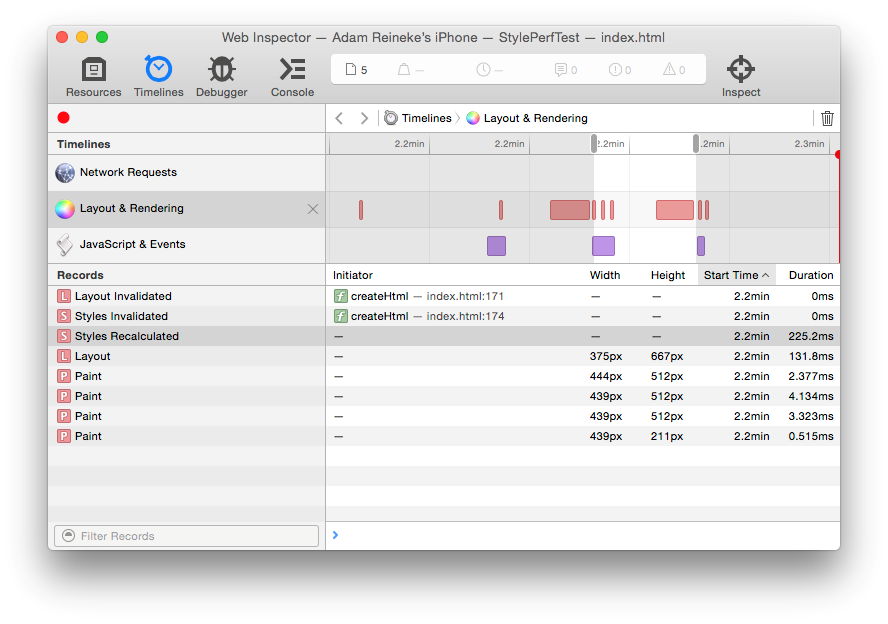
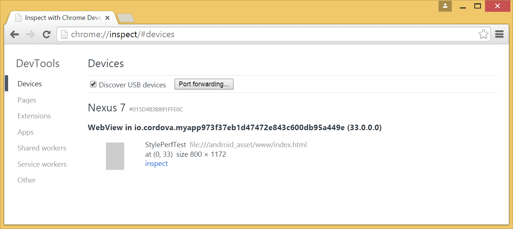
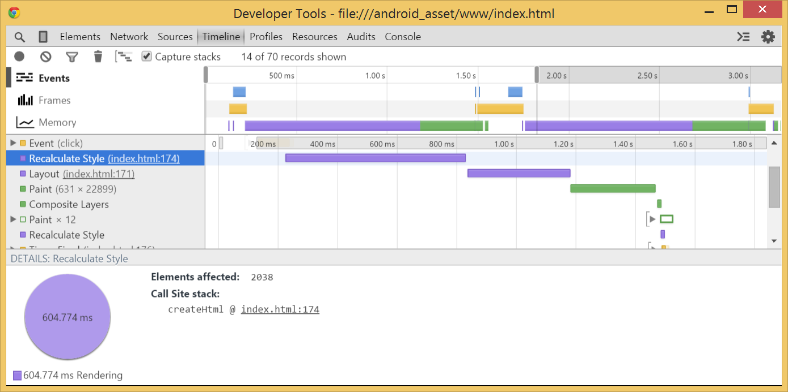
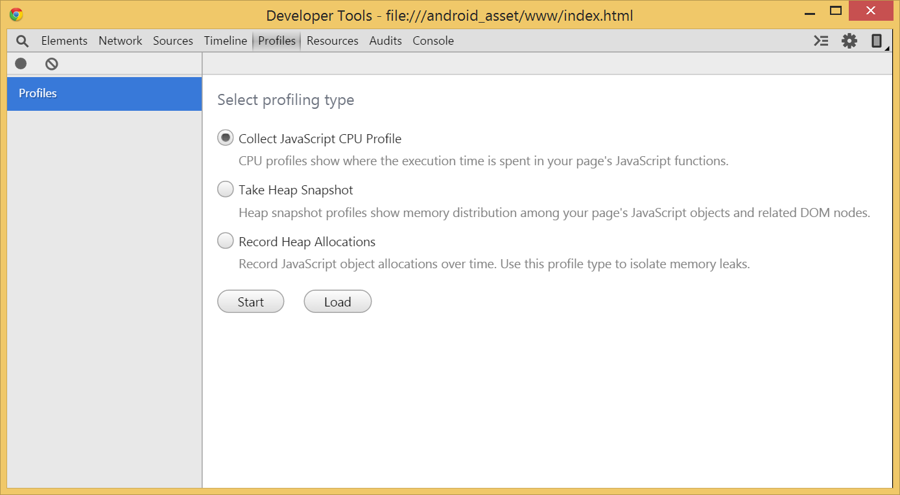
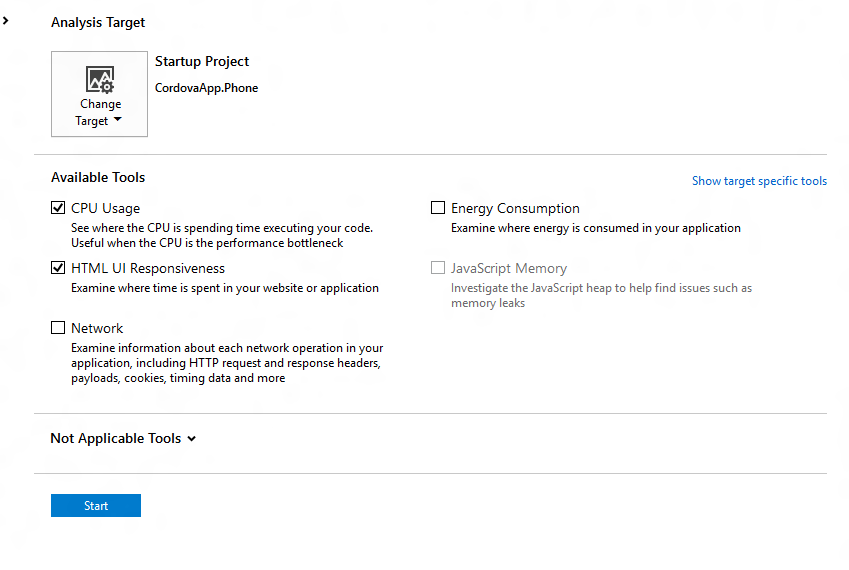
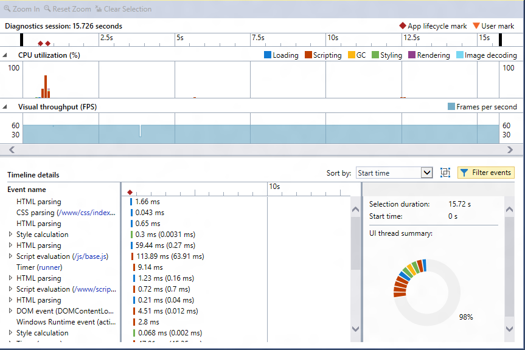
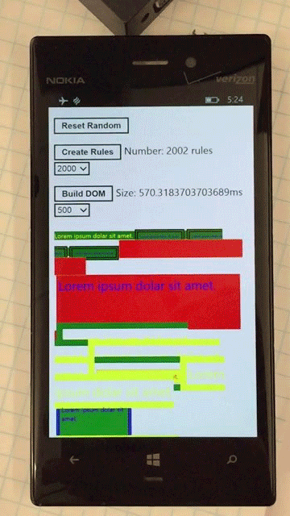

<properties
   pageTitle="Measure the performance of a Cordova app"
   description="Measure the performance of a Cordova app"
   services="na"
   documentationCenter=""
   authors="AdamTReineke"
   tags=""/>
<tags
   ms.service="na"
   ms.devlang="javascript"
   ms.topic="article"
   ms.tgt_pltfrm="mobile-multiple"
   ms.workload="na"
   ms.date="09/10/2015"
   ms.author="adamre"/>

# Measure the performance of a Cordova app

We researched what makes a Cordova app appear fast and fluid, a large part of which was running performance experiments to see how certain app patterns perform. We covered scenarios on Android, iOS, and Windows Phone platforms, ranging from DOM and CSS complexity, startup and resume time, memory usage, animations, and more. While we'll never have enough time to record all the performance numbers everyone could possibly be interested in, we do have the time to share our methods on how we've been doing these performance tests. By sharing these methods, we hope to equip you with the knowledge and tools to reproduce our experiments and come up with their own. This topic will show you how we've been measuring performance by using browser developer tools, JavaScript timings APIs, and video recordings of the user interactions.

## <a id="which"></a>Which is the right method for me?

The methods described below have strengths that are exposed for specific use cases. This table should help guide you.

<style>
    table, th, td {
        border: 1px solid black;
        border-collapse: collapse;
    }
    th, td {
        padding: 5px;
    }
</style>
<table>
<tbody><tr>
  <th>
    <p>**Which tool**</p>
  </th>
  <th>
    <p>**When to use**</p>
  </th>
</tr>
 <tr>
   <td>**Developer Tools – CPU Profiler**</td><td>You are identifying which JavaScript code is taking the most time to run.</td>
 </tr>
 <tr>
   <td>**Developer Tools – Timeline (UI) Profiler**</td><td>You are identifying whether JavaScript or rendering performance may be a bottleneck in your app. </td>
 </tr>
 <tr>
   <td>**JavaScript timing APIs**</td><td>You are measuring the duration of specific scenarios with clear start and end points.</td>
 </tr>
 <tr>
   <td>**Visually timing**</td><td>You are measuring scenarios that are hard to time with code, such as startup time or navigation, or “time to glass” loading/update scenarios that require precise timing.</td>
 </tr>
</table>

## <a id="stats"></a>A quick note on stats

As a rule, when you run performance tests, run as many iterations of the scenario as you can. Since code performance should follow a normal distribution, this enables you to have a much more realistic and accurate measurement.

## <a id="measuring1"></a>Measure performance by using developer tools

Perhaps the quickest way to get performance information is to profile your app. Profilers built into Safari, Chrome, and Visual Studio enable you to easily get information such as CPU usage and how rendering time is spent for your client-side code. These work without requiring you to modify your project.

### Profiling iOS devices by using Safari

If you've deployed your app to a simulator or device connected to your Mac, you can use Safari to connect to your app. If the **Develop** option is missing from the menu bar, go to **Safari**->**Preferences**, then choose the **Advanced** tab and select the **Show Develop menu in the menu bar** checkbox.



From the **Develop** menu item, select your device and the app's main page.


When the tools open, select **Timelines** and then choose the **Record** button. All activity will be recorded. This includes network requests, layout, rendering, JavaScript CPU usage and events that are raised. We can see here that my ```createHtml``` function ended up taking **165ms** itself and triggered a **225ms** style recalculation and a **132ms** layout.



To read more about Safari's Web Inspector tools, visit [https://developer.apple.com/safari/tools/](https://developer.apple.com/safari/tools/).

### Profiling Android devices from Chrome

To profile your device by using Chrome's dev tools, navigate to *chrome://inspect* in the Chrome browser. If your app is running on a connected device that is authorized for remote debugging, you should see it in the list. Click **inspect** to connect the tools to your app.



On the **Timeline** tab of the tools, choose the record icon in the upper left to start profiling UI activity. When you're done performing your activity, choose the record icon again to stop recording.



Chrome has their CPU profiler separate, so you'll need to switch to the **Profiles** tab and select **Collect JavaScript CPU Profile**, then click **Start**.




For more on Chrome's Web Inspector tools, visit [https://developer.chrome.com/devtools](https://developer.chrome.com/devtools).

### Profiling Windows Phone from Visual Studio

You can use Visual Studio developer tools to profile your Windows Phone app.  Start by opening your Windows Phone project in Visual Studio and setting the target, mode, and architecture.  We recommend you choose a device rather than one of the available emulators since an emulator’s graphics and IO characteristics are different from a real device. We recommend that you always use a physical device for performance testing.


To access Visual Studio’s profiling tools you can then go to **Debug** -> **Start Diagnostic Tools Without Debugging**.  This will bring up the Diagnostics Hub where you can pick the tools that you want to run. We found the CPU Usage and HTML UI Responsiveness tools very useful for diagnosing rendering issues in our tests.



Once you check the tools you want to use, click **Start** and it will start your diagnostic session and run the profilers you’ve selected.  Once you stop your session, you will get a report with the summary of your profiling session.



For more on Visual Studio’s developer tools, visit  [http://blogs.msdn.com/b/visualstudioalm/archive/2013/07/12/performance-and-diagnostics-hub-in-visual-studio-2013.aspx](http://blogs.msdn.com/b/visualstudioalm/archive/2013/07/12/performance-and-diagnostics-hub-in-visual-studio-2013.aspx).

### A Word of caution

Using the developer tools is a great way to figure out where your app is slow. However, the numbers you see aren't infallible. The act of profiling slows down execution because the runtime has to save all the profiling information. There’s no way to avoid this, but we expect in most scenarios you won’t be concerned with the overhead that profiling adds to execution time.

## <a id="measuring2"></a>Measuring performance via JavaScript

When figuring out how long a block of code takes to run, a very common approach is to compare the difference in time between the start and end of that block of code. While you might jump to subtracting the number of milliseconds since 1970 returned by Date.now(), that has two catches. First, it only offers millisecond precision, and it's based on your system clock. Since system clocks frequently synchronize with the internet and slowly skew their time to catch up (or slow down) to the internet time, calculating elapsed time via the system clock may not give an exact result.

In case you missed it, since IE 10 and Chrome 20, you'll find support for ```DOMHighResTimeStamp``` via ```performance.now()```. This solves the problems mentioned above. ```performance.now()``` counts from ```navigationStart``` instead of 1970 and returns a double. The whole part is milliseconds since ```navigationStart``` with a fractional part for microseconds. Additionally, the timer runs on a monotonic clock and isn't affected by system clock changes.

For example, to measure the execution of a function, you could time it like this:

```
var start = performance.now();
someCodeToTime();
var end = performance.now();
console.log("someCodeToTime took " + (end-start) + "ms");
```

This works well across much more complicated code, even for asynchronous events, provided your start variable is in scope when your timer stops.

### A Short note on numbers

For more information about ```performance.now()```, see the W3 High Resolution Time spec at [http://www.w3.org/TR/hr-time/](http://www.w3.org/TR/hr-time/).

For some background on inaccurate ```Date.now()``` timings, see this 2008 article from John Resig. [http://ejohn.org/blog/accuracy-of-javascript-time/](http://ejohn.org/blog/accuracy-of-javascript-time/).

### Polyfills for iOS

As of Spring 2015, Safari on iOS still doesn't support ```performance.now()```, so you'll want to polyfill for that platform, remembering that those timings will suffer from the same flaws as ```Date.now()```.

Paul Irish has written a MIT-licensed polyfill available here: [https://gist.github.com/paulirish/5438650](https://gist.github.com/paulirish/5438650).


## <a id="measuring3"></a>Measuring user perceived time

As great as microsecond-precision JavaScript timers are, you now are faced with the issue of accuracy. In our testing, we faced the question of trying to time things that JavaScript timers couldn't answer. For example, since there's no ```PaintFinished``` event, how would you measure how long it takes for a button click to finish updating what the user sees on the screen? One scenario where this method was particularly useful was when we measured app startup time, and timing from when the user taps the icon until the app is loaded.

The answer we came up with was using a high-speed camera. Before you go out and blow your conference budget on a state-of-the-art camera, check your pocket. Several of today's smartphones have high-speed cameras that can record at 120 or even 240 frames per second. When capturing at 240fps, such as with an iPhone 6, you'll capture four frames for ever one frame rendered. This enables you to easily detect exactly when something is rendered to the screen.

Since user perception is the ultimate ruler by which performance is measured, this enables a level of accuracy beyond what we can achieve with JavaScript or profilers.

### Getting the Frames

We used ```ffmpeg``` to take our high-speed videos and split them into individual frames. Here's the command that we used:

```
ffmpeg -i in.mov -qscale:v 2 -s 640x360 outFolder\frame%d.jpg
```
*in.mov* is the input file.
*gscale:v 2* is the quality of the output image (1 is best).
*-s 640x360* is the size of the output image (640x360 is 50% of the iPhone's native recording size at 240 fps).
*outFolder\frame%d.jpg* is the output file (with %d as the frame number).

You'll end up with a directory full of numbered frames. This makes it easy to flip through the images and find the start and end of the event that you're timing, note the difference in frame numbers, and multiply the difference by the time taken for each frame.

At 240fps, if frame 359 was the start and frame 632 was the end, you'd get 632-359 = 273 frames. (273 frames * 1000 milliseconds per second)/240 frames per second = 1137.5 milliseconds for your event.

### Finding all your Frames

Since you probably don't want to spend your afternoon sorting through a folder with thousands of frames, you might want to automate the process of finding the frames. While we don't have code to share, my technique was basically this:

1. Take the average red, green, and blue values of frame n and frame n+2.

2.	Add the rgb values together for each frame.

3.	If the three color averages (0-255) changed by a combined 3 points, mark this frame.

This didn't work too well for start events since there was too much change (finger touching a button), so we would use a conductive stylus to quickly trigger a button, and mark the button outline changing as the start of our event. The faster you get the stylus in and out, the fewer frames you have to look through to find your start event.

### What we saw

A series of frames from one of our experiments, where the updating display is clearly visible.


