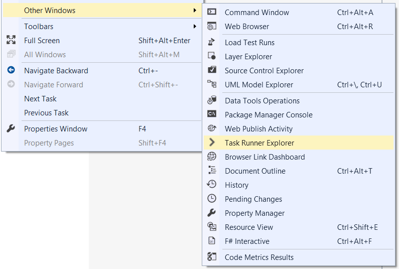

<properties pageTitle="Invoke a Gulp task in a Cordova build"
  description="Invoke a Gulp task in a Cordova build"
  services=""
  documentationCenter=""
  authors="Chuxel" />

#<a name="invoke"></a>Invoke a Gulp task in a Cordova build
> **Important:** This tutorial applies to Visual Studio 2015 and does not apply to Visual Studio 2013 CTPs.

[Gulp](http://go.microsoft.com/fwlink/?LinkID=533803) is an increasingly popular JavaScript based task runner with a large number of [useful plugins](http://go.microsoft.com/fwlink/?LinkID=533790) designed to automate common tasks for everything from compilation, to packaging, deployment, or simply copying files around. Both Gulp and the [Apache Cordova Command Line interface](http://go.microsoft.com/fwlink/?LinkID=533773) (CLI) are Node.js based which makes the two highly complementary technologies.

You may find it useful to fire off a Gulp task right from Visual Studio every time you do a Cordova build particularly when using a Gulp to minify your JavaScript code or compile languages like [TypeScript](http://go.microsoft.com/fwlink/?LinkID=533748), [LESS](http://go.microsoft.com/fwlink/?LinkID=533791), or [SASS](http://go.microsoft.com/fwlink/?LinkID=533792). Fortunately, this is quite easy to do thanks to the "Task Runner Explorer."

##Using the Visual Studio Task Runner Explorer
The Visual Studio Task Runner Explorer provides a convenient way to run Gulp tasks right from Visual Studio. First let's install Gulp globally so it's convenient to use from the command line as well as Visual studio. Type the following from a command prompt:

```
npm install -g gulp
```

Next, create a [package.json](http://go.microsoft.com/fwlink/?LinkID=533781) file in your project (if one is not already present). This will be the location you will use to reference Gulp or any [Gulp plugins](http://go.microsoft.com/fwlink/?LinkID=533790) you want to use.

```json
{
  "devDependencies": {
	"gulp": "latest"
  }
}
```

You can install these dependencies at any time in Visual Studio by right-clicking on the Dependencies node in the Solution Explorer and selecting "Restore Packages".


Note that, thanks to Visual Studio's command line interoperability, you can also update package.json outside of VS and type the following to install whatever you have added to package.json:

```
npm install
```

This is what the Task Runner Explorer execute under the covers when you "Restore Packages." In general you should not add the "node_modules" folder that is generated into source control and it is omitted from the Solution Explorer in Visual Studio for this reason.

Similarly, you can update package.json with additional dependencies by hand in Visual Studio or use the npm "--save-dev" flag from the command line. For example, this will both install the [uglify Gulp plugin](http://go.microsoft.com/fwlink/?LinkID=533793) and add it as a dependency:

```
npm install --save-dev gulp-uglify
```

Now that we have the needed dependiencies installed, create a file called "gulpfile.js" and add it to the root of your project. For example, here is a simple Gulp task.

```javascript
var gulp = require("gulp");
gulp.task("before-build", function() {
	// Add anything you want to do before the build here
});
```

In Visual Studio, open the Task Runner Explorer by going to View \> Other Windows \> Task Runner Explorer.



After clicking the "Refresh" button you will then see the Task Runner Explorer with the before-build task we created visible.


Now to attach this to the "Before Build" event, right click and select Bindings \> Before Build.


The next time you run a build this task will automatically fire! You can also execute tasks without binding them to an event simply by selecting "Run" from the same context menu.

##Supporting Task Runner Explorer Bindings from the Command Line
By default, bindings in the Task Runner Explorer only work inside of Visual Studio. When working outside of Visual Studio we generally recommend simply running the Gulp tasks directly from the command line. For example, this will run the Gulp task we created above:

```
gulp before-build
```

However, you may want to be able to simply assign bindings in Visual Studio and have them apply from builds at the command line or in a team / Continuous Integration (CI) environment. Fortunately this is fairly straight forward to do via a [Cordova "hook"](http://go.microsoft.com/fwlink/?LinkID=533744).

To do so, [follow these directions to add a pre-built Cordova hook to your project](hook-task-runner-binding/tutorial-gulp-hook-task-runner-binding-readme.md). You can then modify it as you see fit to meet your needs.

## More Information
* [Learn more about using Gulp with your Cordova projects](tutorial-gulp-readme.md)
* [Read tutorials and learn about tips, tricks, and known issues](../cordova-docs-readme.md)
* [Download samples from our Cordova Samples repository](http://github.com/Microsoft/cordova-samples)
* [Follow us on Twitter](https://twitter.com/VSCordovaTools)
* [Ask for help on StackOverflow](http://stackoverflow.com/questions/tagged/visual-studio-cordova)
