<properties pageTitle="Package your Cordova app so that you can publish it"
  description="Package your Cordova app so that you can publish it"
  services=""
  documentationCenter=""
  authors="subhagpo" />
  <tags
     ms.service="na"
     ms.devlang="javascript"
     ms.topic="article"
     ms.tgt_pltfrm="mobile-multiple"
     ms.workload="na"
     ms.date="02/17/2016"
     ms.author="normesta"/>

# Package your Cordova app so that you can publish it

Create a package for each platform that you want to target. Then you can publish each package to a store.

## Package the Android version of your app

**In this section:**

* Modify the general settings of your app.

* Generate a private key.

* Refer to that key in a configuration file.

* Create the package.

### Step 1: Modify the general settings of your app

The general settings of your app appear in the **Common** page of the configuration designer.


* The **Display Name** is the name that appears in the app store.

* The **Package Name** is a string that uniquely identifies your app.

    Choose a naming scheme that reduces the chance of a name conflict.

* The **Domain Access** collection lists the domains that your app needs to access.

    For example, the WeatherApp that appears in the previous image, obtains weather data from a service endpoint that has the domain ```https://query.yahooapis.com```.

The purpose of most other settings clear from the title, but you can find more information about them here: [The config.xml File](http://go.microsoft.com/fwlink/p/?LinkID=510632&clcid=0x409).

### Step 2: Generate a private key

To sign your app, create a *keystore*. A keystore is a binary file that contains a set of private keys. Here's how you create one.

1. Open a Command Prompt in administrator mode.

2. In the Command Prompt, change directories to the ```%JAVA_HOME%\bin``` folder.

    (For example: ```C:\Program Files (x86)\Java\jdk1.7.0_55\bin```).

3. In the Command Prompt, run the following command.  

    ```
    keytool -genkey -v -keystore c:\my-release-key.keystore -alias johnS
    -keyalg RSA -keysize 2048 -validity 10000
    ```

    Replace ```my-release-key.keystore``` and ```johnS``` with names that make sense to you. 

4. You'll be asked to provide a password and the *Distinguished Name* fields for your key.  

    This series of responses gives you an idea of the kinds of information you'll provide for each prompt. Like in the previous command, respond to each prompt with information that makes sense for your app.

    ```
    Enter keystore password: pwd123
    Re-enter new password: pwd123
    What is your first and last name?
    [Unknown]= John Smith
    What is the name of your organizational unit?
    [Unknown]= ABC
    What is the name of your organization?
    [Unknown]= XYZ
    What is the name of your of your City or Locality?
    [Unknown]= Redmond
    What is the name of your State or Province?
    [Unknown]= WA
    What is the two-letter country code for this unit?
    [Unknown]= US
    Is CN=John Smith, OU=ABC, O=XYZ, L=Redmond, ST=WA, C=US correct??
    [no]=  y

    ```

    After you provide this information, output like this appears in the Command Prompt.

    ```
    Generating 2,048 bit RSA key pair and self-signed certificate (SHA256withRSA)
    with a validity of 10,000 days for: CN= John Smith, OU= ABC, O= XYZ,
    L=Redmond, ST=WA, C=US

    Enter key password for <johnS>
        (RETURN if same as keystore password):
    ```

    The Android SDK generates the keystore as a file named **my-release-key.keystore** and places that file in the C:\ drive. The keystore contains a single key, valid for 10000 days.

    If you want more detail about this process, see the Android developer documentation here: [Signing your applications](http://developer.android.com/tools/publishing/app-signing.html).

### Step 3: Refer to the private key in a configuration file

First, identify which version of the Cordova CLI that your project uses. That determines which configuration file you use to refer to your key.

#### Find the CLI version of your project

The CLI version number appears in the **Platforms** page of the configuration designer.


You can also find it in the ```taco.json``` file at the root of your project.

#### If your Cordova CLI version is lower than 5.0, use these steps

1. In **Solution Explorer**, expand the project folder. Then expand **res**->**native**->**android** and choose the **ant.properties** file.

    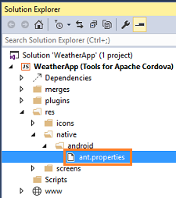

    The **ant.properties** file opens in the code editor.

2. In the **ant.properties** file, add the information that describes your key.

    ```
    key.store=c:\\my-release-key.keystore
    key.alias=johnS
    key.store.password= pwd123
    key.alias.password= pwd123
    ```

    >**Important**: Don't surround these values with quotation marks (For example: "pwd123"). This can cause build errors.

#### If your Cordova CLI version is greater than 5.0, use these steps

1. In **Solution Explorer**, expand the project folder, and then choose the **build.json** file.

    

    The **build.json** file appears in the code editor.

2. In the **build.json** file, add the information that describes your key.

    ```
    {
     "android": {
         "release": {
             "keystore":"c:\\my-release-key.keystore",
             "storePassword":"pwd123",
             "alias":"johnS",
             "password":"pwd123",
             "keystoreType":"",
           }
       }
    }
   ```

### Step 4: Create the package

1. On the Standard toolbar, choose the **Android** platform.

    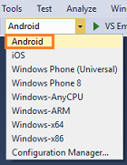

2. Choose one of the Android emulators.

    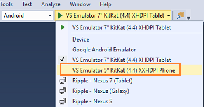.

    >**Important**: Don't choose any of the Ripple simulators. Choose only an Android emulator or the Device.

3. Choose the **Release** build configuration.

    

4. On the **Build** menu, choose **Build Solution**.

    This builds a file with an .apk file extension. That is the file that you'll upload to the store.

    You can find that file in the ```bin/Android/Release/``` folder of your project.

    It's the file that *does not* contain the word ```unaligned``` in the file name.

    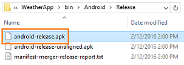

### Submit your app to the store

You can publish your app to Google Play.

To prepare for the big day, review [Essentials for a Successful App](http://developer.android.com/distribute/essentials/index.html).

Then, see [Upload an app](https://support.google.com/googleplay/android-developer/answer/113469?hl=en) to make your app avaialable to the world.

## Package the iOS version of your app

**In this section:**

* Request a distribution certificate.

* Create a distribution provisioning profile.

* Download the distribution provisioning profile in Xcode.

* Modify the general settings of your app.

* Create the package.

### Step 1: Request a distribution certificate

A distribution certificate identifies your team or organization.

1. Start Xcode.

    If you haven't installed Xcode, see the [First, install a few things onto your Mac](./getting-started/ios-guide.md#use-developer-account) section of the [iOS setup guide]().

2. In Xcode, add your Apple ID (If you haven't done so already).

    See [Adding an Apple ID to Your Accounts](https://developer.apple.com/library/ios/recipes/xcode_help-accounts_preferences/articles/add_appleid.html).

4. In the menu bar, choose **Xcode**->**Preferences**.

5. In the **Accounts** page, choose the **View Details** button.

5. In the account details page, choose the **Create** button next to the **iOS Distribution** *signing identity*.

    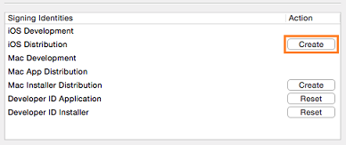

    Looking for more information about signing identities? See [Creating Signing Identities](https://developer.apple.com/library/ios/documentation/IDEs/Conceptual/AppDistributionGuide/MaintainingCertificates/MaintainingCertificates.html#//apple_ref/doc/uid/TP40012582-CH31-SW6) (Optional reading).

6. Choose the **Done** button to close the account details page.


### Step 2: Create a distribution provisioning profile

A distribution provisioning profile lets you submit your app to the store.

1. On the [Member Center](https://developer.apple.com/membercenter/index.action) page, choose the [Certificates, Identifiers & Profiles](https://developer.apple.com/account/overview.action) link.

2. In the [Certificates, Identifiers & Profiles](https://developer.apple.com/account/overview.action) page, choose the [Provisioning Profiles](https://developer.apple.com/account/ios/profile/profileLanding.action) link.

3. In the [Provisioning Profiles](https://developer.apple.com/account/ios/profile/profileLanding.action) page, choose the **+** button.

    

4. In the [What type of provisioning profile do you need?](https://developer.apple.com/account/ios/profile/profileCreate.action) page, choose the **App Store** option, and then choose the **Continue** button.

    

5. In the **Select App ID** page, choose the App ID of your app, and then choose the **Continue** button.

    

6. In the **Select certificates** page, select the distribution certificate that you created earlier in Xcode, and then choose the **Continue** button.

    

8. In the **Name this profile and generate** page, name your profile, and then choose the **Generate** button.

9. In the **Your provisioning profile is ready** page, choose the **Download** button.

Need more detail? See [Creating provisioning profiles using Member Center](https://developer.apple.com/library/ios/documentation/IDEs/Conceptual/AppDistributionGuide/MaintainingProfiles/MaintainingProfiles.html#//apple_ref/doc/uid/TP40012582-CH30-SW24)

### Step 3: Download the distribution provisioning profile

1. Open Xcode.

2. In the menu bar, choose **Xcode**->**Preferences**.

3. In the **Accounts** page, choose the **View Details** button.

4. In the account details page, choose the **Download** button next to your provisioning profile's signing identity.

    

5. Choose the **Done** button to close the account details page.

### Step 4: Modify the general settings of your app

The general settings of your app appear in the **Common** page of the configuration designer.


* The **Display Name** is the name that appears in the app store.

* The **Package Name** is a string that uniquely identifies your app.

    This identifier has to match the identifier of your distribution provisioning profile.

    

    You can find the indentier of your profile by choosing your distribution profile in the [Provisioning Profiles](https://developer.apple.com/account/ios/profile/profileLanding.action) page of the Apple developer [Member Center](https://developer.apple.com/membercenter/index.action).

    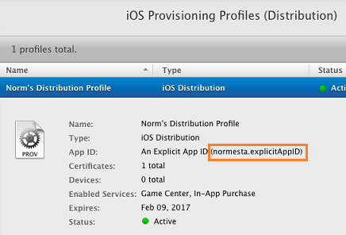.

* The **Domain Access** collection lists the domains that your app needs to access.

    For example, the WeatherApp that appears in the previous image, obtains weather data from a service endpoint that has the domain ```https://query.yahooapis.com```.

The purpose of most other settings clear from the title, but you can find more information about them here: [The config.xml File](http://go.microsoft.com/fwlink/p/?LinkID=510632&clcid=0x409).


### Step 5: Create the package

Build your app to generate the package that you will submit to the store.

1. On your Mac, make sure that the remote agent is running.

    See [Start the remote agent on your mac](./getting-started/ios-guide#remoteAgent).

2. In Visual Studio, open the project for your app.

3. On the Standard toolbar, choose the **iOS** platform.

    

4. Choose **Remote Device**.

    .

5. Choose the **Release** build configuration.

    

6. On the **Build** menu, choose **Build Solution**.

    This starts a build on the remotebuild agent and uses the distribution certificate and the matching provisioning profile to build a release signed iOS Application Archive (.ipa) file.

    You can find that file in the ```bin/iOS/Release``` folder of your project.

### Submit your app to the store

See [Managing Your App in iTunes Connect](https://developer.apple.com/library/ios/documentation/IDEs/Conceptual/AppDistributionGuide/UsingiTunesConnect/UsingiTunesConnect.html#//apple_ref/doc/uid/TP40012582-CH22-SW7) on the Apple Developer website.

If your app isn't accepted by the store, review these articles by Apple:

* [Common App Rejections](https://developer.apple.com/app-store/review/rejections/)

* [App Store Review Guidelines](https://developer.apple.com/app-store/review/guidelines/)

## Package the Windows version of your app

First, decide which platforms and device families you want to make your app available to. You can make your app available to Windows Phones, desktop PCs, and tablets.

It doesn't matter which version of Windows the app targets. The Windows store accepts all of them. That said, the operating system of a device or PC only runs apps that target the same version of that operating system or an earlier version.

To learn more about Windows package and Windows device compatibility, see [OS versions and package distribution](https://msdn.microsoft.com/library/windows/apps/mt188601.aspx#os).

**In this section:**

* First, set some general properties.

* Make your app available to Windows Phones.

* Make your app available to Windows desktop PCs or tablets.

* Install your app on a device or publish it to the store.

### First, set some general properties

In the **Windows** page of the configuration designer, provide the **Display Name**, the **Package Name**, and the **Version** number of your app.


* The **Display Name** is the name that appears in the app store.

* The **Package Name** is a string that uniquely identifies your app.

    Choose a naming scheme that reduces the chance of a name conflict.

### Make your app available to Windows Phones

Which version of Windows does your app target? Choose a section:

* [Your app targets Windows 10](#windows-10).
* [Your app targets Windows 8.1](#windows-81).
* [Your app targets Windows 8](#windows-8).

#### <a id="windows-10"></a>Your app targets Windows 10

1. In the Standard Toolbar, choose **Windows-ARM**.

    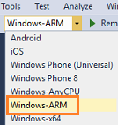

2. In the **Windows** page of the configuration designer, choose **Windows 10** from the **Windows Target Version** dropdown list.

    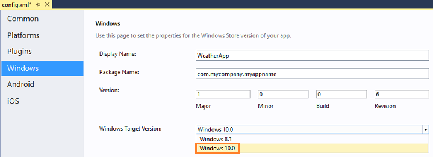.

3. Choose **Project**->**Store**->**Create App Packages** to start the packaging wizard.

    

4. Complete the wizard.

    For step-by-step guidance, see [Create an app package](https://msdn.microsoft.com/en-us/library/windows/apps/xaml/mt627715.aspx#create_package)

5. Find your packaging files in the ```AppPackages``` folder in the root of your project.


6. [Install your Windows app onto a device or publish it to the store](#publish-windows).

#### <a id="windows-81"></a>Your app targets Windows 8.1

1. In the Standard Toolbar, choose **Windows Phone (Universal)**.

    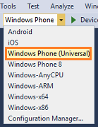

2. In the **Windows** page of the configuration designer, choose **Windows 10** from the **Windows Target Version** dropdown list.

    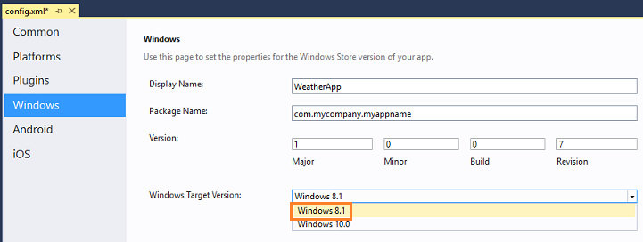.

3. Choose **Project**->**Store**->**Create App Packages** to start the packaging wizard.

    

4. Complete the wizard.

    For step-by-step guidance, see [Create an app package](https://msdn.microsoft.com/en-us/library/windows/apps/xaml/mt627715.aspx#create_package)

5. Find your packaging files in the ```AppPackages``` folder in the root of your project.

6. [Install your Windows app onto a device or publish it to the store](#publish-windows).

#### <a id="windows-8"></a>Your app targets Windows Phone 8

1. In the Standard Toolbar, choose the **Release** configuration.

    

2. Choose **Windows Phone 8**.

    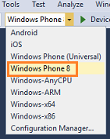

3. Choose **Build**->**Build Solution** to build your package.

4. Find your packaging files in the ```bin\WindowsPhone8\Release``` folder in the root of your project.

5. [Install your Windows app onto a device or publish it to the store](#publish-windows). 

### Make your app available to Windows desktop PCs or tablets

1. In the Standard Toolbar, choose **Windows-AnyCPU**.

    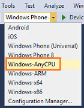

2. In the **Windows** page of the configuration designer, choose **Windows 10** or **Windows 8.1** from the **Windows Target Version** dropdown list.

    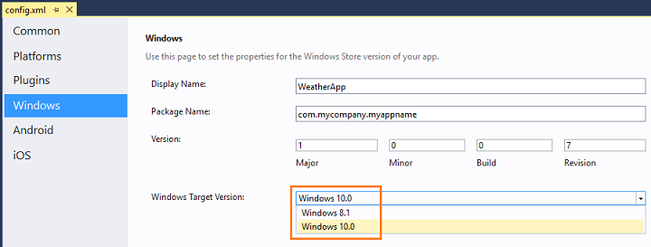.

3. Choose **Project**->**Store**->**Create App Packages** to start the packaging wizard.

    

4. Complete the wizard and in the wizard choose which platforms you want to make your app available to.

    For step-by-step guidance, see [Create an app package](https://msdn.microsoft.com/en-us/library/windows/apps/xaml/mt627715.aspx#create_package)

5. Find your packaging files in the ```AppPackages``` folder in the root of your project.


### <a id="publish-windows"></a>Install your Windows app onto a device or publish it to the store

To publish your app to the store, see [Publish Windows apps](https://dev.windows.com/en-us/publish).

To install your app directly onto a device [Sideload your app package](https://msdn.microsoft.com/en-us/library/windows/apps/xaml/mt627715.aspx#sideload_package).
